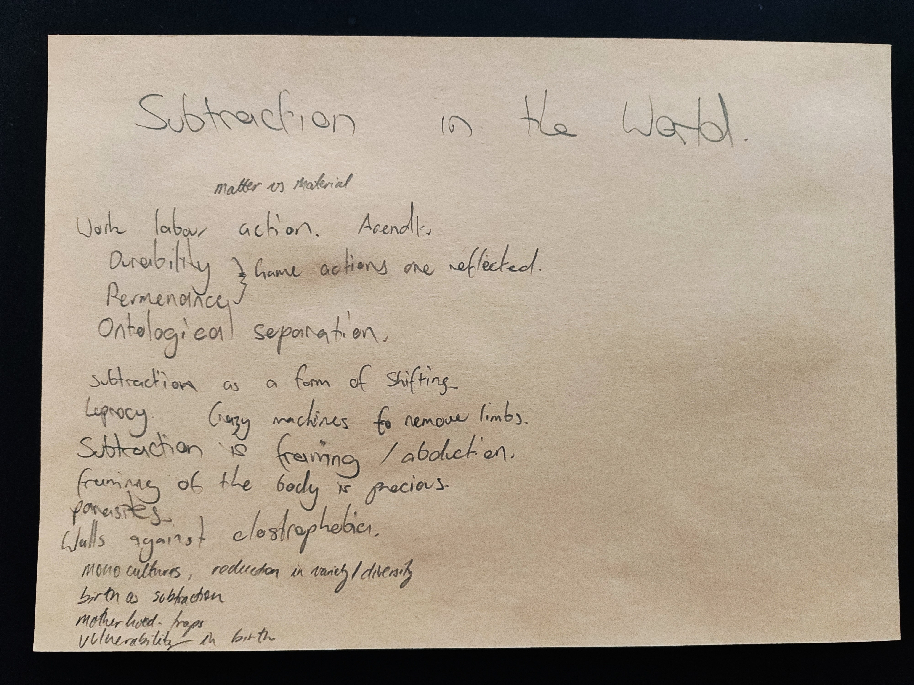
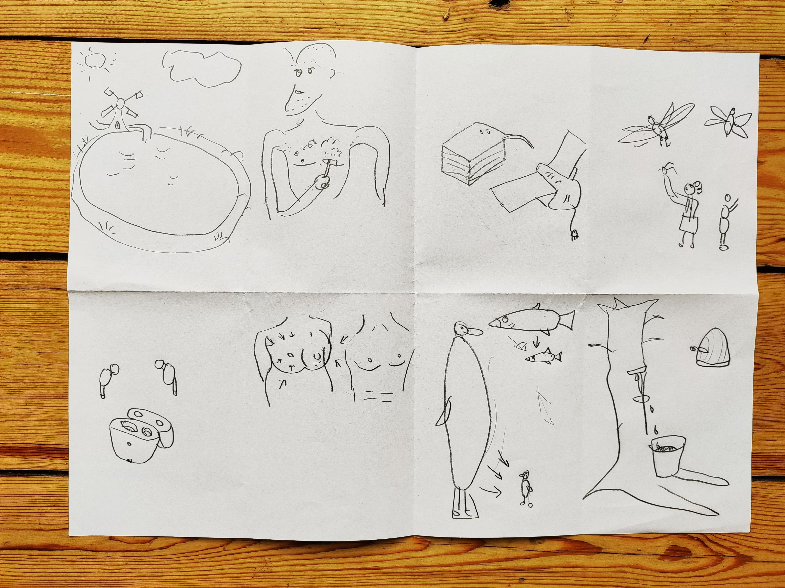
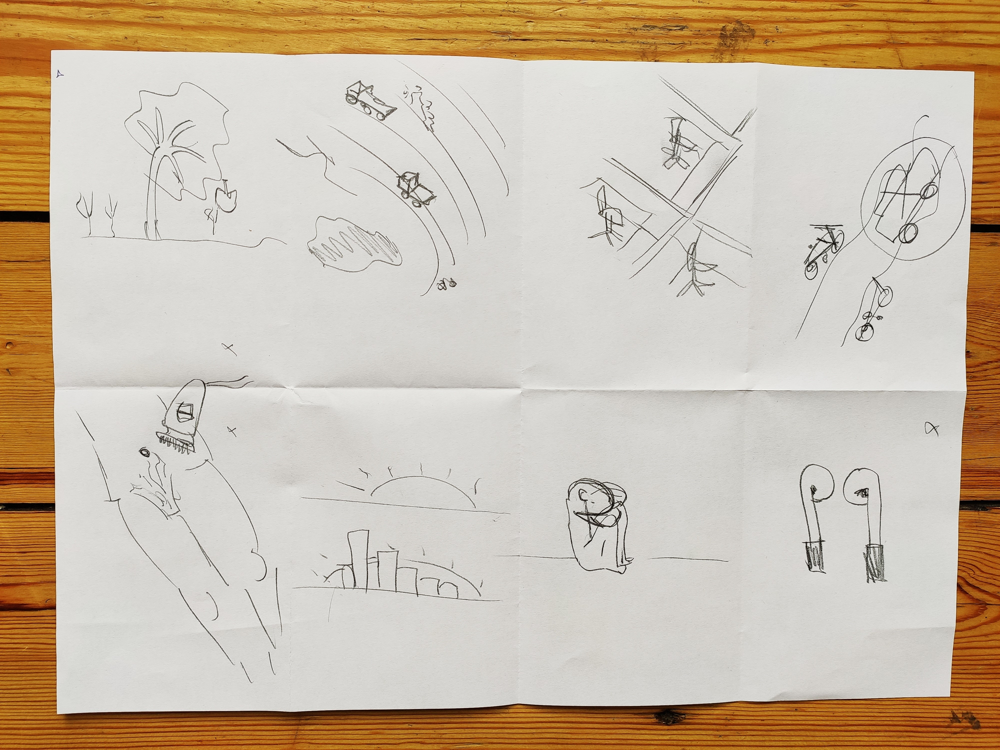
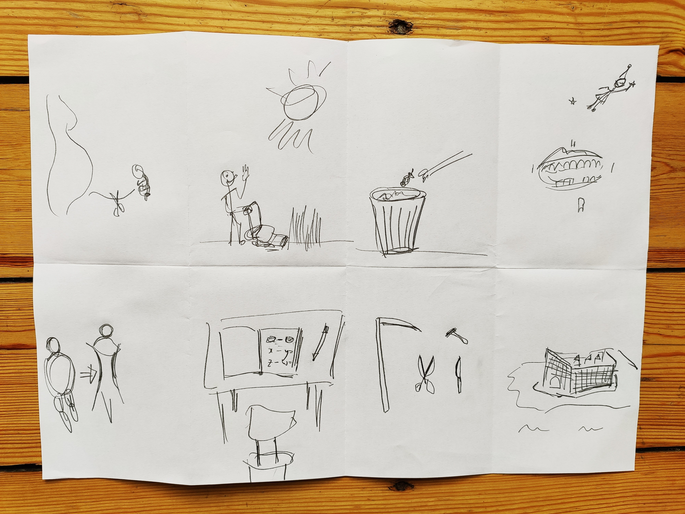

During the group design session between 10-12th February at our studio in Berlin we spent our time generating and testing ideas for methods of subtraction, and methods to elaborate on these through game dynamics. Alongside our other activities we tried one of [Google Ventures Crazy 8's](https://designsprintkit.withgoogle.com/methodology/phase3-sketch/crazy-eights) design exercises for exploring conceptual links. I had experience using these in my other game work and it was a nice way to go beyond initial idea bias.

The basic idea is that you have 8 minutes in which to complete 8 sketches aimed at a specific goal or target. You may not work ahead, and if you fall behind you should stop your drawing. It's a daunting task but ultimately yielded some nice talking points which this post will enumerate (in 100 examples or less).

## Sketches

import FigureCaption from './FigureCaption';

<FigureCaption text="Roel's 8 sketches" />

<FigureCaption text="Jae's 8 sketches" />

<FigureCaption text="Alex's 8 sketches" />

## 100 examples or less

> Birth  
> Falling or picked apple  
> Maintenance  
> Disposal  
> Losing a tooth  
> Weight loss  
> Subtraction in math class  
> Sharp edges. Cutting always happens on a plane. 3D needs a 2D plane to slice it.  
> Exclusion as subtraction  
> Loneliness  
> Polder. Land reclamation  
> Shaving  
> Stack of paper next to the printer. Getting smaller over time  
> Extinction  
> Pulling off legs of insects for fun  
> Noise cancellation / Airpods  
> Breast reduction  
> Decline of size of species over time. So slow no one notices.  
> Rubber collection - Parasites  
> Mining / Resource Extraction / Local Minima  
> Cubicles / Shutting out / artificially subtracted area  
> Cars removed from road  
> Amputation  
> Sterilization  
> Negation ( 1 + -1 = 0)  
> Lobotomy  
> Organ donation  
> Antidepressants  
> Contraception  
> Clipping birds wings  
> Straight jacket  
> Vomiting / blood letting / Excretion / Breast feeding / Spitting / Ejaculation / Crying  
> Corset  
> Foot binding. Slow. Taming. Domesticating. High heels  
> Drop tail lizard  
> Sensory deprivation  
> Censoring  
> Etiquette  
> Protocol, discipline, punishment, diplomacy  
> Permanence  
> Time-sharing -> Gun sharing?  
> Leprosy  
> Mowing grass  
> Jail / Isolation  
> Parasite

## Expanded notes

### Birth

Birth is often celebrated as an addition to the world, or termed more drily the multiplication of a species. An event of appearance and growth.

Thinking literally though, a mother sheds weight after 9 weeks of swelling at birth. The umbilical chord is snipped. Physically speaking there is less of her and an increasing amount of an other now outside her and separate, her child. She is no longer pregnant, only mother.

With the image of birth as a form of subtraction in mind, we thought of ways in which this could inform a game. Narratives and game dynamics are easily criticised for favouring the phallus - drawing its inspiration from it as though in awe or admiration. This is nicely put in Ursula LeGuin's *Carrier Bag Theory of Fiction* essay. Why not think of games that feature womb like elements: bags, containers, traps, or even the process of birth more explicitly?

We briefly speculated introducing birth into the spawning process in game mechanics. Say a shooter in which you must travel through the birth canal to respawn in the (game) outdoors. We thought about the period of pregnancy as a form of self-vulnerability.

### Matter vs Material

> Matter becomes material in the presence of mind.

I remember this quote from a presentation at HNI in Rotterdam Alex and I attended. We see the mowing the lawn as an example of this. Before our interference, it just is. It's not 'the' grass, it just is grass. When we take our intention and apply it to it, grass becomes 'the' grass. A substance that is now of worth, either positive or negative, becoming of our will. Regardless of our frame of reference this materialisation creates our product - neat grass - and our waste - lawn clippings. The material is split in two, separated from it's own burden. Appropriated and discarded.

We see this process as first a libation. A rally of the spirit. We gain, but what of the waste? Those inextricable burdens simply shifted aside. This burden is not disappearing. It is becoming out of sight, but not out of body. Either it haunts us, our future actions impacted by it, or it follows us. We are our own temporal victims, set to manage our chaos incurring divisions of the world but further divisions. Recycle, reuse, re-re-re.

We thought this idea of intention could however be balanced. Similar to the ideas of grooming it is a matter of equilibrium that keeps us in check. That sure feeling in your mind that your intentions on the world are manageable. Starting from our appearance, and extending our to **our** existence.

### Monoculture

If then one act of subtraction is dividing, another could be seen as the pure reduction. No intentionality makes a cut. We just choose to limit the bounds of objects. A route again to manage chaos. Reducing diversity means we can for once, have a good grasp of things. Ideas of sterilisation, etiquette, censoring, and protocols all self reinforce. What is taken away begets less space in between and a monoculture is approached.

Things like LOD (level of detail) in object rendering in games could be seen as an instancing of this, although in their use the principle is about reducing details out of immediate focus of the user. One conceptually interesting use of this is where objects, or players, in far away regions are given a different polling rate. That is, they are given a different rate in which they are allowed to view the world. Subtraction here is shrinking the spaces, details, and times between things.

### From trash -> Work / labor / action

We borrow the ideas of the work / labor divide from Hannah Arendt. Where labor is concerned with creating consumable products, the creation of 'work' is for the long run. Its products are durable and permanent. However today this boundary becomes less defined as products originally intended to last are more readily consumed.

We have now an environment where our furniture becomes consumable (I gave away my bed when I moved from NL to Berlin, only to buy the same one again on moving here), our clothes are churned out fast, and our TV is on demand. This takes away a key element from the idea of durability. A durable item is one that is independent of the whims of people. Value is fleeting and functionality is impermanent.

We see the progression accelerating through rent-an-x and the uber-of-things. Why own anything these days? Possess less, have less responsibilities. This of course goes alongside an increasing insecurity. That is, if you stop earning, stop moving, your life simply vanishes. Things have fallen to the whim of people, and as an individual we feel it the hardest.

Our materialisation now costs a monthly fee.

### Subtraction as a form of shifting

We revisit the waste of our mowed grass. Less about the division now, we can look at subtraction through the lense of frame shifting. Take the metaphor for this concept as holding an empty picture frame up to the world. The inside, the content, the relevance. The outside out of view and out of focus. The background is by easy measure invisible.

Or another case, that when we teach the concept of subtraction to children, first the child counts X of a given thing. Then, as a cunning ruse against permanence we remove some of the thing, and put it behind our backs. We ask the child to count again. What has been lost has been shifted out of the child's frame of perception. The 'waste' is now no longer with us.

We thought of the ideas of ghosts of subtraction. As touched upon earlier, the occurrence of the material out-of-view becomes this ghost. Here we directly connect the ideas of the value of our limbs. Where when attached to us they have such immense and incalculable value, once removed this is dashed almost instantly. We frame our body as precious, and when this frame shrinks, to exclude say a limb, it's presence haunts us, but no longer connects congruently to it.

### Abduction / myth / conspiracy

Speaking of numbers we found ourselves in the mathematical realm. We have natural numbers (positive whole numbers). Then we have non-natural numbers (all others). Could we have super natural numbers? Ideas of subtraction around these numbers don't necessarily have to equate. We could see our limbs as these supernatural entities. Take one away and add another. This operation does not cancel as would a normal calculable.

I guess what I'm pointing to here is the idea of paradox as a way for us to escape linear thinking when it comes to the values of subtractive occurrences. Where, as Alex has told me, we build walls around us in our houses so we don't see the immensity of the population around us. Walls closing in effectively shields us from our own claustrophobia.

Or to Roel, where his older neighbours remember times where the local eel was much longer. Today it is much shorter. The eel is trying to hide. Whereas we keep getting taller, trying to peek over each other's fence.
