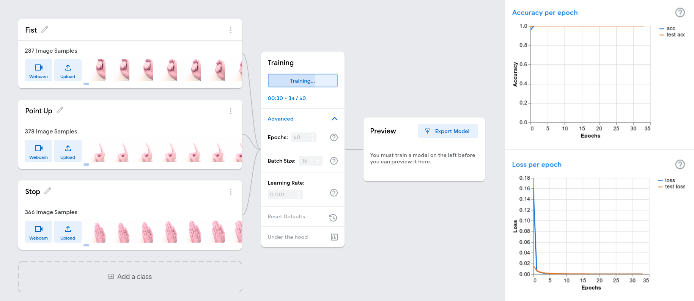
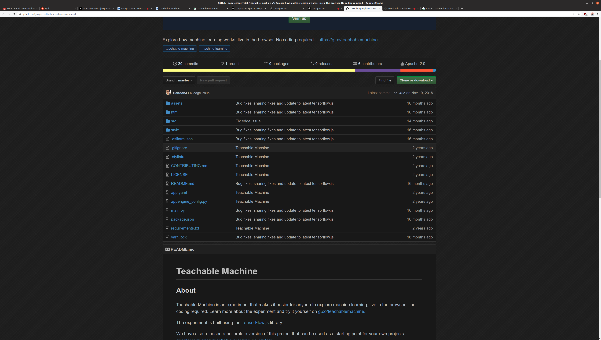

import Video from './video';

<Video videoSrcURL="https://www.youtube.com/embed/dQw4w9WgXcQ" videoTitle="Gatsby is Never Gonna Give You Up" />

## The Game

### Terminology

### Rules

### Observations
