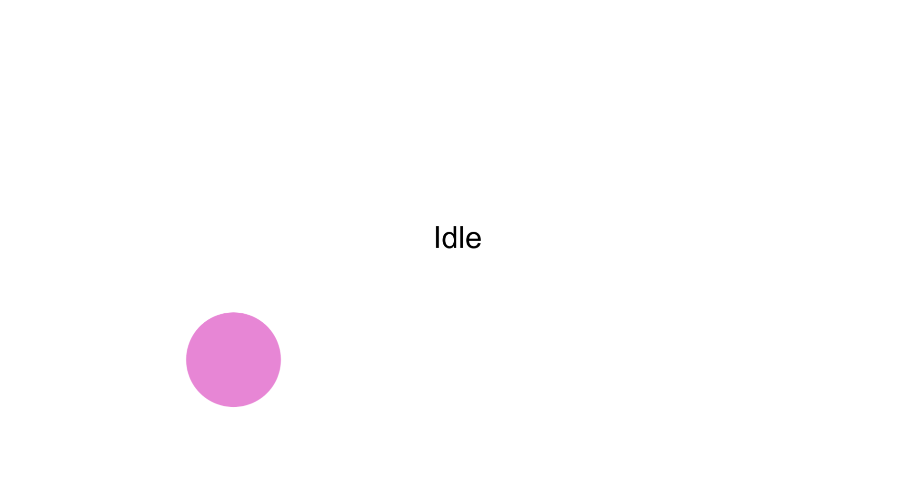

 <!-- screenshot of 'idle' game status + jump with pointing up -->

The body is lost in a computer system. Or perhaps I better say reduced to a series of symbols, points. Our eyes, ears and fingertips are the primary interfacing points of contact with the machine. Through practice and design, human-computer interaction has become reductionary when it comes to the body of the human involved. The exchange is concentrated in points; data points communicated through points of the body. 

## A Pointed Existence

For the machine to do its job, the body interfacing with it might as well consist of no more than a handful of finger tips strung together to a pair of eyes, controlled in some intent-driven fashion. Our existence, we concluded, tends to be pushed out to our senses and the machine takes this to an extreme. 

This reduction is a mechanism of symbolism. Symbolism works to immaterialise and compress its referent, arguably making the material body obselete. Access to a larger symbolic/ point space goes at the cost of interfacing with the collective of bodies that constitute it. Working with thousands of photographs of animals to train an image classifier reduces the represented bodies to weightless symbols. We gain access to an immense point space, but loose track of the bodies originally(?) involved. A basic but relevant principle of data science - thinking data, we think points. Points free themselves of the mass of bodies, by representing them as a series of points. It's a loop that's hard to escape but doesn't get any more profound either.

Both an implication and motivation of this is the achievement of ease of access. Technologies are constantly prized for bringing products/ services/ entertainment closer and closer 'to our fingertips'. These therefore become our only means of access, points of contact. As such they are also the reductions of our (bodily) dimensionality. These symbols of fingertips allow us to begin to bypass the body in work and play. Computational processes multiply the realm of immaterial labour.

What then happens when we work our way from the tips of our fingers back into the rest of the body? 

## A Gesture-Controlled Ball Game

Taking the most direct route outwards, we began by a retreat to the whole hand. To begin to work on this issue of bringing the body back into computer processes, we started experimenting with possible modes of game control. We built a simple gesture-based control system for a ball on the screen.

import Video from './video';

<Video videoSrcURL="https://www.youtube.com/embed/626Mg63n_nU" videoTitle="Gesture-Controlled Ball Game" />

We used the Google [Teachable Machine](https://teachablemachine.withgoogle.com/ "Google's Teachable Machine") web tool to train a neural network to recognise our chosen set of control gestures. A fist to roll, an open palm to stop, a finger pointing upwards to jump, and no hand at all as an idle state. This was no doubt (perhaps paradoxically) an instance of machine learning at our fingertips; it could not get much easier to use. With a few clicks we had a trained model that we could export and integrate into our JS ball game.

Playing around with this experiment clearly showed that involving more of the body than the fingers pressing keys results in sacrificing precision in control. Key presses and mouse clicks yield immediate and close to absolute accuracy. In contrast, webcam-captured gestures are misinterpreted and take more time to reformulate. 

To even use our hand (not even the whole body) as a game control we needed to reduce it to a set of points. The necessity of point spaces remains embedded in the issue. Perhaps similar experiments can be a step towards making immaterial work if not more material, at least more physically embodied.

<!-- 
Points to cover
> how/where the body is lost
> reduction to points through symbolism
> ease of access and bringing things/ services/ entertainment 'to our finger tips' - our points of contact, means of access, reductions of our (bodily) dimensionality
> what happens when we bring the body back into computer processeces, starting with game dynamics
> our experiment
> findings/ results: less precision in control 
-->