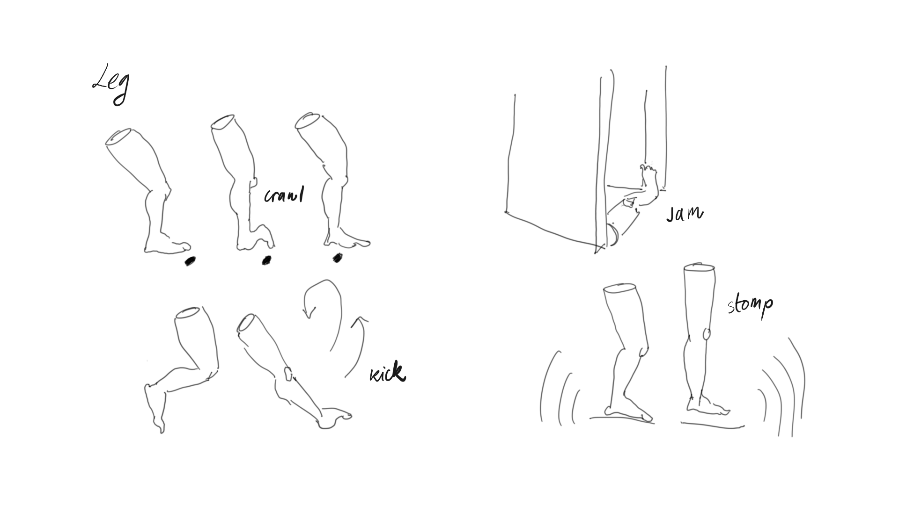
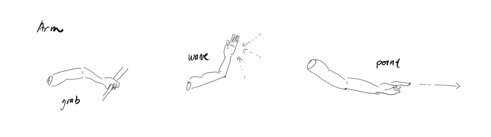
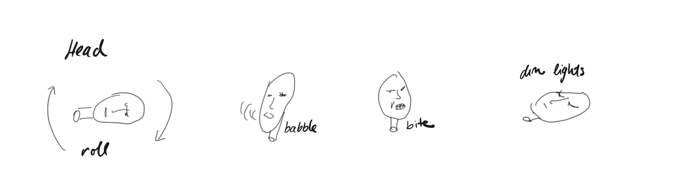

This week we moved on to the third of four planned mini development projects. Following some [asset design](/hair-removal-game) and [storyboarding](/hair-removal-game-storyboarding) for a hair removal game concept and an inquiry into [death in video games](/materiality-of-bodies-in-video-games) and [where the (dead) bodies go](/ragdoll-machinima), we decided to tackle a problem that comes closer to the initial vague idea we had for our video game. In one of our [brainstorming exercises](/pc-game-ideas) we re-formulated this idea once more as:

> A game in which you need to multitask, but the tasks are at a number of different places at once. You need to figure out how to best split your body up to achieve this. You keep track of each body part across a split screen view that corresponds to your cuts.

To give this idea more substance, we started thinking about the actions that individual limbs are able to carry out on their own, when detached from the torso. The sketches included here give an overview of some of the primary actions we thought of.

### Leg

Legs can crawl, jam things, kick and stomp. Crawling is slow, but it's the only way that a leg can move along a surface unaided by the rest of the body. Legs can jam things - both open and shut. A leg could also trip other characters when laying down horizontally, while for example, jamming a door open. Legs can kick. The effect of kicking when there's nothing in the space around to kick is a boomerang-effect jump. Finally, they can stomp. Stomping keeps enemies off, but also generates sound which can help with navigation through echolocation.

### Arm

Arms grab, wave and point. As they have no way to move on their own, they need to grab onto other game characters to move; they are parasitic travelers. They are also great manipulators. Waving attracts the attention of other characters, who may then be drawn towards the waving arm. Pointing directs other characters' attention in the pointed direction. This can be a way of getting things done remotely or a distraction. Pointing while traveling becomes a form of steering.

### Head

A head rolls, babbles, bites and controls the lights. Rolling is the primary displacement tool for a head, but it comes at the cost of the camera spinning with it. A head can babble and others listen; this might hold them up for a while. The head can attach itself to things by biting them and control lighting in a scene with its own eyes.

These individual limbs can be severed off of their torso and act in different locations of a game autonomously. They can also freely reconnect with the torso, granted that they are in the same location to do so. A torso needs at least two limbs (any combinations of arms and/or legs will do) to move. This means that as soon as the torso is left with one or no limbs, its is the limbs that will need to make their way back to the torso to complete certain tasks in the game.

