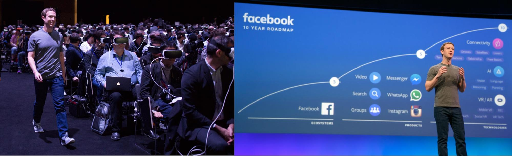

Midway through December last year we were happy to hear that the grant application we submitted to the Stimuleringsfonds for continuing Figureable in 2021 was successful! For this second phase of the project, we decided to narrow the focus of our work a bit. We plan to continue our research through developing a VR game.

In the upcoming series of posts I’ll highlight some of the motivations and inspiration sources that we’ll be working from.

First though, I’ll use this post to give a summary of the context that we’ll be situating our new project plan in. Then, one glaring question to address is why a VR game? Previously, we haven’t actually paid all that much explicit attention to VR, besides perhaps [addressing some of the medium’s limitations](./movement-in-vr).

### A background summary to our plan

The main issues we plan to work from are the increasing (1) prevalence of bodily-mediated digital technologies and (2) importance of our digital identities. Bodily movement is at the confluence of these two; movement is that being mediated, and at the same time, that which carries our self-expression and identity.

In this context, we face a new reality in which our movement is exposed for exploitation through movement-based input technologies. It is no longer only the things we chose to do that are trackable, but also the way in which we do them; the way we carry ourselves from A to B, the way we sit and chew our nails while we plan our next keystroke.

We’re planning on making a VR game that addresses these issues. Given that VR is one of the technologies directly implicated in this problem — namely, tracking bodily movement and relaying it to organisations like Facebook — we aim to create an experience in the medium itself that can reveal and raise awareness about these issues. We believe that this can be more powerful than using an auxiliary medium to comment on technologies like VR from the outside.

### Why VR?

The popularity of VR is growing. Big tech firms are investing in the technology under the guise of making it more accessible. Video game producers are increasingly releasing games for VR only; earlier this year for example, the much anticipated new Half Life game, Alyx, was released in VR. We find it important for artists, designers, researchers and developers like ourselves to explore this medium-on-the-rise both creatively and critically.

_Facebook presenting investment plans for VR.[^1] Left: Conference participants strapped into Facebook Horizon. Right: Zuckerberg presenting a 10 year road map of the platform, anticipating growth in the VR sector._

Entangled with its rising popularity, is the unique potential of VR to create immersive, embodied experiences. We see value in these experiences as a playground for exploration beyond individual boundaries. In this respect, we take inspiration from work like AR/VR developer Daniel Beauchamp’s [experiments](https://twitter.com/pushmatrix), in which he explores new ways to use your hands in VR — making, for example, a VR experience in which your fingers grow longer after each move. For these reasons, we find it relevant for the makers of new VR experiments to look to inspire people’s corporeal imaginations, outside of what might be possible for them IRL.

In parallel, VR games and experiences are becoming widespread in exhibition contexts as well. These works however, rarely address the medium of VR itself, to speculate on its own potential futures and implications. In the next stage of Figureable, we aim to both create an immersive, embodied game, and at the same time use VR in order to reflect on this rising technology.

[^1]: Lang, B. (2020, Aug 28). ‘In ‘Horizon’ Facebook Can Invisibly Observe Users in Real-time to Spot Rule Violations’. Road to VR. Retrieved on 28 September 2020 from: https://www.roadtovr.com/facebook-horizon-privacy-monitoring-moderation/.
