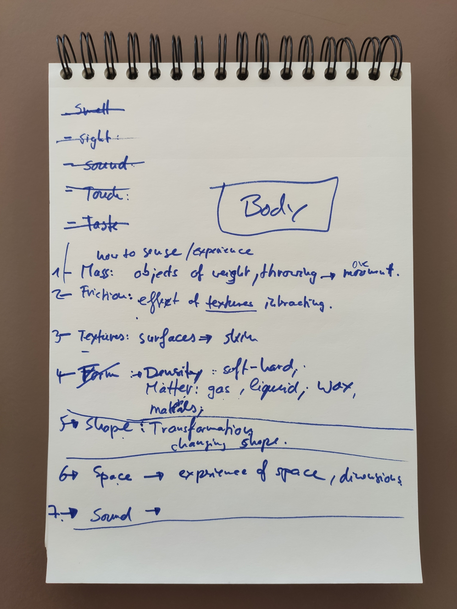

Since February we’ve been meeting roughly bi-weekly as a whole team (at the moment that means Jae, Luna and myself, Alex) to discuss our findings and ideas. Until now our exploration of VR has been pretty open ended. We’ve met strangers in VRChat, attempted trending games like Beat Saber, dressed up avatars for solo parties in VR Club, gotten sick playing VR mods of some of the older Half Life games, made friends with virtual pets like Bogo, visited art exhibitions in Mozilla Hubs… The list gets longer, but the main point is that it’s quite random.

Now that we have a feel for the breadth of games and experiences that VR offers, we’ve decided that it’d be useful to continue our exploration of the medium with a more concrete direction in mind.

In one of our last sessions we came up with a framework to guide our next series of experiments.

We started our discussion with the human senses, as these are most obviously tightly knit with the ways in which we make sense of our physical bodies. Quickly though, we moved into territory better characterised by our proprioception and objects’ materiality. To explore these grounds in VR, we came up with a list of physical/spatial concepts, which we find influence our bodily experiences across virtual and physical space.

1. Mass — apparent weight in weightless spaces
2. Friction — moments when objects and surfaces interact
3. Texture — tactility of surfaces that wrap meshes
4. Density — physical states of matter and ranging scales of hardness
5. Shape — transformations in three dimensions
6. Space — virtual surroundings from a first person point of view

The thread running through our exploration will be the role and experience of our bodies in the medium.

Practically speaking, these experiments will also help us build up a library and toolkit for our upcoming VR piece. [As we last mentioned](/web-xr-or-unity), we’ll be working with the WebXR standard, so we’re excited to start with this right away. We plan to keep busy experimenting throughout the rest of March and April.

