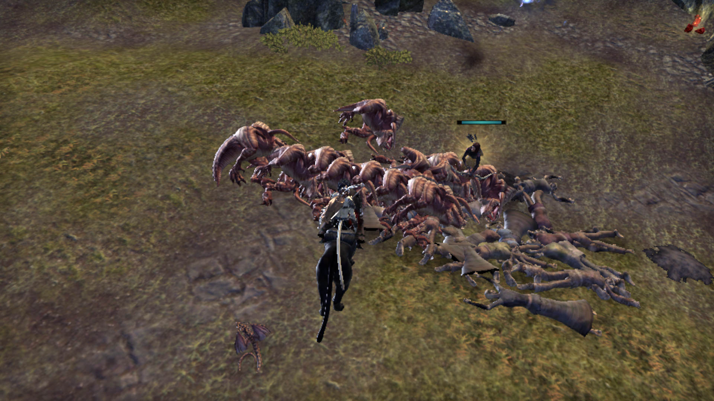
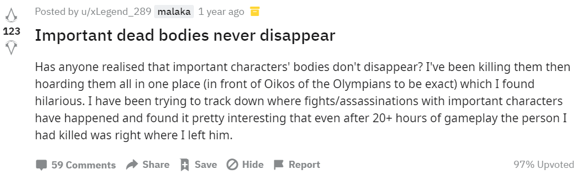
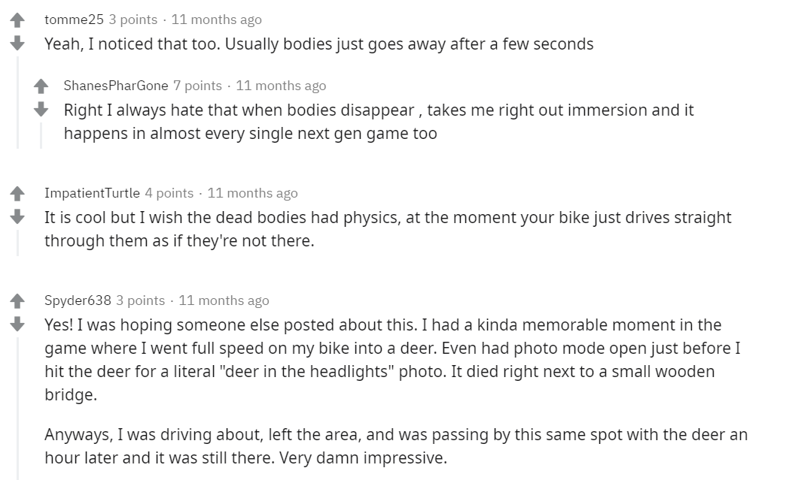
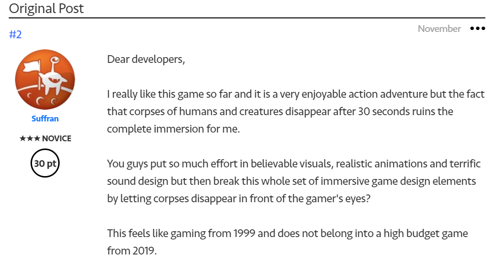

*An image posted in the Elders Scroll discussion thread on the issue 'ZoS, Please Clear Bodies Away >:('* [^1]

### Expecting to kill, expecting to die

Death, in many games, is expected. For one, players expect to die. In games where killing and death are a feature or end of gameplay, that is.

One of the player stats of Counter-Strike is a kill/death ratio (KD). On the Subreddit of CS:GO, somebody asked

The answers show what the question suggests; that it’s rare to go deathless.

> “JKS twice”  
>  
> “I want to say f0rest did on train near the beginning of CSGO, I can't remember against who though.”  
>  
> “This is from CS:S 2009 or 2010, don't remember, but ex6tenz had a 40something 0 score in 15 rounds on train against the Danish national team, which had players from the best teams in Denmark at the time (fetish, wantz, gravityy).
Searched for the screenshot that went around cadred, but it's like finding a needle in a haystack.”[^2]

That’s to say, the occasions are countable and memorable (to a surprising level of detail).

### Expecting dead bodies to disappear

Once dead, a body disappears from the game environment. This still tends to be the default in most games. The need to ask for ‘List(s) of games where bodies don’t disappear?’[^3] suggests that this is somewhat of a niche feature. While once this was (and arguably to a certain extent still is) an issue of computational power and performance, today the persistence of dead bodies in a game is achievable. The question of why game developers choose not to implement it has become a legitimate one making its way into online forums. To some, letting dead bodies disappear has become a point of criticism; it annoys players, people dislike, or hate it. And there is a demand to keep the dead.

> “I really don't know why, but I can't stand it when dead bodies and other things like debris disappear instantly in games. There's just something really satisfying to me about seeing a sea of bodies after a heated battle, and when dead bodies just disappear right in front of your eyes, it just feels really disappointing.
I'm just curious if it's only me who feels this way…”  
>
>”Yes, it bugs me. It feels incredibly lazy and removes any form of immersion.  
Some say it makes things smoother but plenty of games can do it fine so the ones who don't have no excuse.”  
>
> “In L4D, I would like to see the mountain of bodies I've just created.”[^4]

In the Assassin's Creed subreddit people shared the ‘realisation’ that ‘important characters' bodies don't disappear’. Some players pile them up in one place.[^5]

The question ‘Anyone else really impressed by how long the bodies stay?’ in the Days Gone subreddit was met with some positive experiences of this game feature.[^6]

The 2019 Star Wars Fallen Order game has been criticised for exactly this issue.[^7]

While bodies’ post-death disappearance is a default, this seems to be changing.

You can find more on death in games [here](/expectations-of-death-in-video-games).

A related machinima we have put together can be found [here](/ragdoll-machinima)

### Sources

[^1]: [https://forums.elderscrollsonline.com/en/discussion/412830/zos-please-clear-bodies-away](https://forums.elderscrollsonline.com/en/discussion/412830/zos-please-clear-bodies-away)

[^2]: [https://www.reddit.com/r/GlobalOffensive/comments/7vmv25/has_any_player_ever_went_perfect_0_deaths_in_a/?utm_source=amp&utm_medium=&utm_content=post_title](https://www.reddit.com/r/GlobalOffensive/comments/7vmv25/has_any_player_ever_went_perfect_0_deaths_in_a/?utm_source=amp&utm_medium=&utm_content=post_title)

[^3]: For example: [https://www.gamespot.com/forums/games-discussion-1000000/list-of-games-where-bodies-dont-disappear-29211807/](https://www.gamespot.com/forums/games-discussion-1000000/list-of-games-where-bodies-dont-disappear-29211807/) or [https://steamcommunity.com/discussions/forum/12/1693785035811247312/](https://steamcommunity.com/discussions/forum/12/1693785035811247312/)

[^4]: [https://v1.escapistmagazine.com/forums/read/9.131992-Do-Games-With-Instantly-Disappearing-Bodies-Annoy-You](https://v1.escapistmagazine.com/forums/read/9.131992-Do-Games-With-Instantly-Disappearing-Bodies-Annoy-You)

[^5]: [https://www.reddit.com/r/assassinscreed/comments/afwsmt/important_dead_bodies_never_disappear/](https://www.reddit.com/r/assassinscreed/comments/afwsmt/important_dead_bodies_never_disappear/)

[^6]: [https://www.reddit.com/r/DaysGone/comments/bhn67r/anyone_else_really_impressed_by_how_long_the/](https://www.reddit.com/r/DaysGone/comments/bhn67r/anyone_else_really_impressed_by_how_long_the/)

[^7]: [https://answers.ea.com/t5/General-Discussion/Disappearing-dead-bodies-ruin-the-immersion/td-p/8442154](https://answers.ea.com/t5/General-Discussion/Disappearing-dead-bodies-ruin-the-immersion/td-p/8442154)