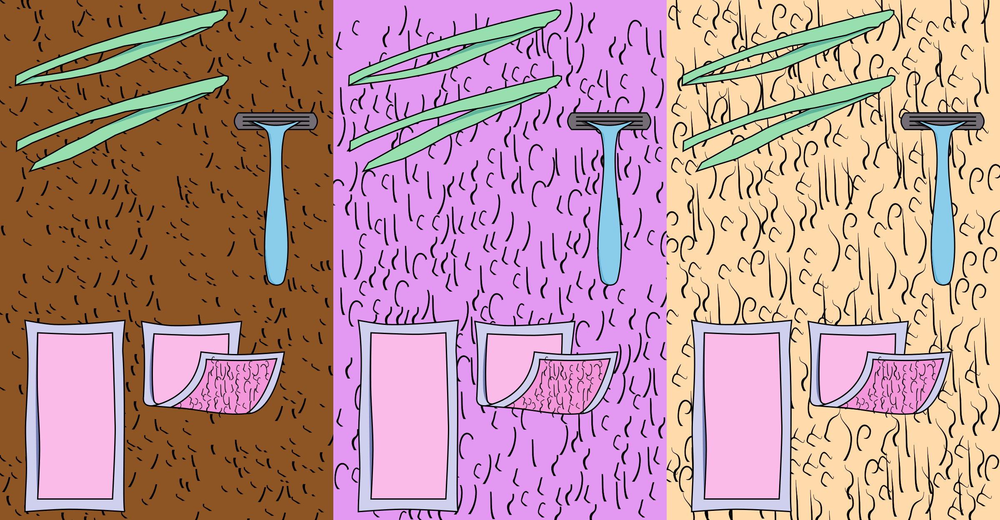

Yesterday we planned our next two months of work. We decided that we would break this period into developing certain aspects - like dynamics, design or narrative - of four different game ideas which allow us to practice some of the skills required in the ultimate piece.

The idea that we decided to start with is, quite simply put, a hair removal game. A pretty common form of subtraction.

## Game Concept

> A game in which you need to groom the hairs on your body into a range of different styles, shapes and lengths with a range of available tools.

We imagine this early game concept to be best suited for playing on mobile. The player has a set of tools they can use (razors, tweezers, waxing strips, scissors, epilators…) with which they shave/ pluck/ wax/ trim/ cut hairs. In the gameplay, they see a close up of the skin on the body part they are grooming at a given moment on the screen. The game can get progressively more difficult with more complex demands (shaping eyebrows or styling the pubic region as opposed to simply fully shaving or waxing the lower legs), or its complexity may increase through the need to keep track of all the body’s hairs as they keep growing back and to continuously groom them, in line with your changing taste and fashion.

## Game Design

To develop an aspect of this game, we chose to focus on the game design of three hair removal methods applied to a strip of skin that fills the screen - so no curves, edges, wrinkles etc. For this we used Inkscape to create our own razor, tweezer and waxing strip svgs. We also made a series of different length hairs. Here are some of the ways in which we thought of removing body hair in this game.

import { CustomImage } from './CustomImage';

<CustomImage src="./images/pluck.gif" title="Plucker" height="300px" />
<CustomImage src="./images/shave.gif" title="Pluck" height="300px" />
<CustomImage src="./images/wax.gif" title="Pluck" height="300px" />
