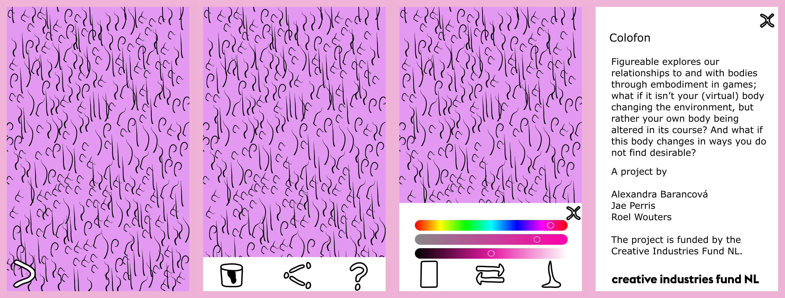

This week we spent some more time developing our [hair removal game idea](https://figureable.netlify.com/hair-removal-game). Thinking of ways in which our hair removal game assets could be integrated, we did a storyboarding exercise to imagine an app in which this could be done.

### Buttons, navigation

For now we see it as a simple interface. A hair-growing skin surface fills your device screen. Swiping a small arrow in the bottom left corner, a bottom aligned banner slides out, through which you can navigate to customise, share or get more information. We imagined customisation as being limited to  changing the colour of the skin and hair. This would be done using a set of sliders, meaning that any colour could be selected; we thought using HSL would be most intuitive. For sharing we thought it would be worthwhile exploring native sharing options further rather than remaking our own. Further information would be displayed full-screen. All pop-up menus could be closed with a button in the top right corner, but also through simply tapping on any visible skin.

### Removing hair

Although we briefly considered using a menu to select hair removal tools too, we decided that it would be more interesting if this could be determined through gestures:

a razor shaves when a single finger is dragged up or down (or perhaps in any direction)  
a waxing strip is applied when two fingers are dragged down  
a waxing strip is peeled/ripped off when two fingers are swiped up across an already applied strip  
a set of tweezers pluck a single hair when two fingers are pinched together

The tool assets themselves would appear on screen at touch, but only start removing hair with dragging. As an alternative we thought that the tools themselves could only appear once a dragging movement is started, in order to avoid flickering between, for example, a razor and waxing strip as you alternate between having one and two fingers on the screen. In our storyboarding session we thought that the first, flickering version could be a suited effect for the game, but some more prototyping would help us determine this.

