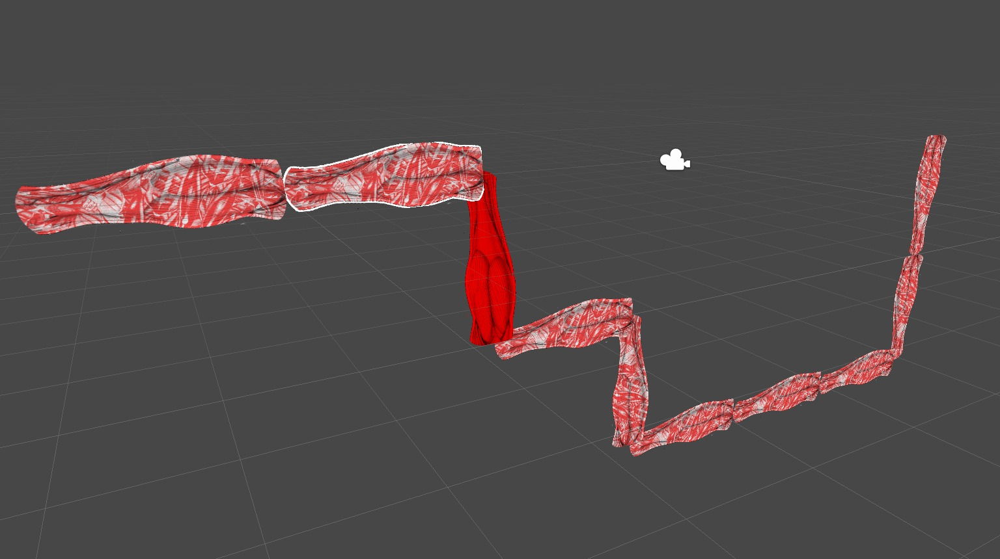

This week we returned to the [first game concept](https://figureable.netlify.com/day-1-game-1) that we had put together on day 1. The game - or maybe 'exercise' would be a more fitting way to describe it - was fun at the time, but barely replicable in a consistent way. Keeping track of the limbs and joints that we were choosing to rotate and lock was complex to the extent that it became hard to pay attention to the emergent movement of the limb-bodies. We had concluded the session agreeing that the game might be better enjoyed as a computer simulation.

We find it relevant to engage with modes of movement for the development of our game concept, so we found this messy rotation game worth revisiting nevertheless. For a revised version, we wanted to make the exercise more playable. To focus the game on the part we found most interesting - the movement of a body emergent from rotations of sets of limbs around different joints - we decided to cut down some of the choices that we had originally thought of leaving to the player.

import Video from './video';

<Video videoSrcURL="https://youtu.be/A5oeBiwXVAg" videoTitle="Jointed Limb Game" />

> ### Rules
>
> #### Setup
>
> Each player is given a set of six numbered limbs (1-6).
>
> The players can make a random shape out of the limbs by connecting them using any number of joints. To begin with, each limb needs to make a 90\deg angle with at least one of its neighbours. The jointed set of limbs makes up the player's body - their game character.
>
> Each of the bodies is placed on/ perpendicular to a grounding line along which it can travel in the game.
>
> #### Gameplay
>
> The player rolls a dice. The rolled number corresponds to the limb that needs to be kept still (locked) in a player's move - this means that it stays vertical if it is vertical, or horizontal if horizontal, in the move.
>
> The player then chooses to move the limbs on either side of this locked limb with a 90&deg rotation, clockwise or anti-clockwise, around the common joint.
>
> The grounding line acts as a surface with gravity. This means that if a player ends up "off the ground" following a move, they "fall" directly "downwards".
>
> Players take turns to complete the course. It becomes somewhat of a race.

In this game, a body can get smaller by folding limbs over each other. On a later turn, the body can then also unfold given a suitable dice roll. The movement created with this game dynamic is contained in and embodied by each set of limbs and joints. The game dynamic does not rely on consumption for "progress" through its course. 

### Unity Implementation

Interested in the range of motion that can result from this simple set of rules, we decided to implement a version of the game in Unity. This was a fun exercise in coming up with an algorithm to rotate sets of limbs around any chosen joint.

<Video videoSrcURL="https://www.youtube.com/embed/A5oeBiwXVAg" videoTitle="Jointed Limb Game in Unity" />

We did find that playing the game with physical paper cutouts, pins and a dice was somehow more satisfying.

### Future Uses

Although as it is this small project does not necessarily lend itself to being an exciting game, the game dynamic may be something that we can make use of or revisit once again in the future. The contraction and expansion of a body through the mechanism of folding over itself could be a particularly interesting way of interpreting subtraction. The process and aesthetic of creating bodies as/from sets of limbs could perhaps also be explored further.
