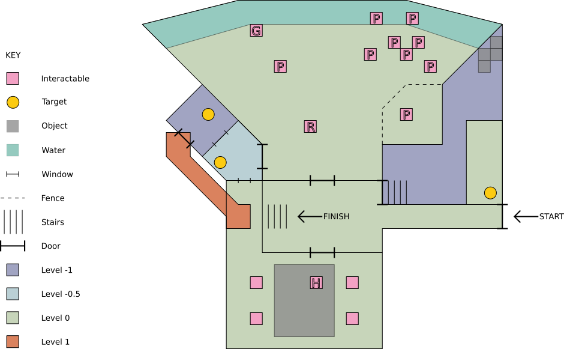
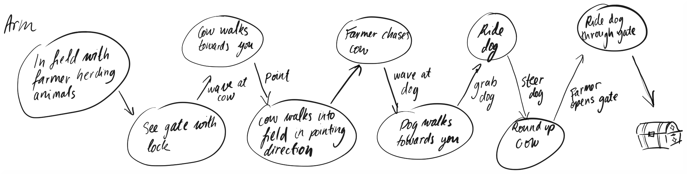
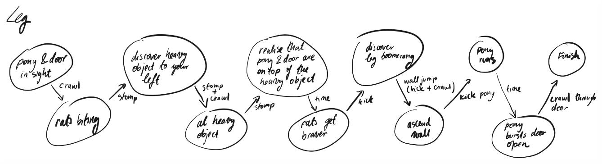
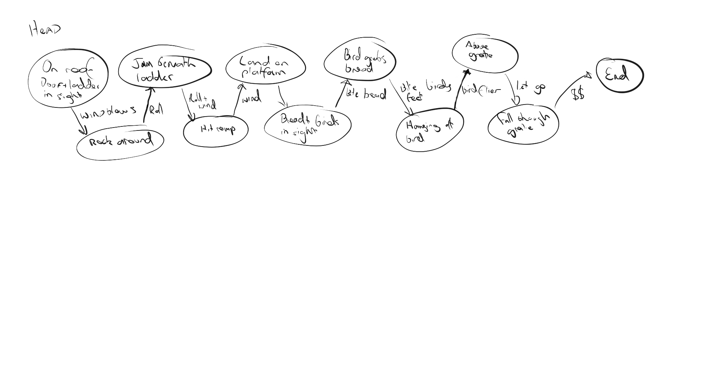
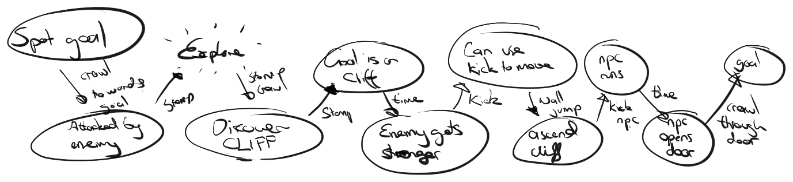

This week our goal was to gain some experience with game level design. Working further from the game concept of [autonomous limbs](/autonomous-limbs) that we started developing last week, we wanted to create a level map that could integrate game components involving all three limb characters; the arm, the leg and the head. For this end, we came up with three distinct scenarios each of which engaged one of these characters as its main protagonist. We then thought of a game world in which we could imagine similar scenarios taking place. Finally, we stitched the three scenarios together in a shared game environment set in this world, which would require its player to send their arm, leg and head to carry out three different tasks autonomously. This is our final level map:

With the rest of this post, we contextualise this map by elaborating on (1) the game world we imagined, (2) the specific scenario that a player would face in the level illustrated by our map, and (3) the process of coming up with the individual limb-specific scenarios.

### Game World: Planet of Zentra

We imagine this game to be set on a planet that was once inhabited by an intelligent alien species. About a century ago, the planet was mysteriously abandoned by these people, and they seemed to have left in a rush. Although gradually decaying, their technology and architecture are still intact for the most part. Automated systems continue to function, as they were never switched off. 

#### The Settlers

We don’t know much about these peoples, but discover snippets of their history as we progress through the game, navigating what once used to be their space. From the few collected xenoarchaeological accounts of these aliens, we know that they had a distributed consciousness; their intelligence was decentralised and spread throughout their bodies, rather than being localised in a single brain-like entity as we’ve encountered in most other highly intelligent species. They worshipped a number of cephalopod creatures and had an octo-based numeral system. The last piece of information that is stressed repeatedly in the literature is their practice of Zentra. It is said that once a cycle, they would undergo a vital process of nourishment in which individuals would flush their bodily fluid, called zentra, with fresh zentra. Zentra is said to be a silvery thick liquid, and the blood of both the people and its cities.

Early on in the game, the player discovers that this species had the ability to dis- and re-join their limbs at their will. The skill took practice, but in principle, everyone was capable of learning it. As such, separating one’s body was an integral marker of wisdom in their society. Those who could split more were granted access to knowledge or tasks that required more responsibility.

#### The Architecture

Arriving at a once settled region of the planet, the centrality of Zentra is pretty hard to overlook. Silver-stamped pipes thread through the buildings, seemingly reaching deep into all its corners. In the game the pipes become landmarks to follow. In the outskirts these pipes are branched and thin. Leading deeper into the heart of the city they thicken, and become better protected. Eventually they lead the player deeper towards the liquid’s source; a goal that the player aims to discover. The city layout is built around this pipe system - real city pipe maps could be used as inspiration for further development of the game’s city layout and architecture.

As you enter new spaces in the game, the abandoned city attempts to 'turn on' the room, reactivating the lights and the flow of Zentra. This acts as a traceable element, marking progression for the player and making orientation easier.

Threaded by piping, the built environment is made up of tall, tightly packed sleek buildings. Here and there, octogonal open spaces break up the high-rising structures. The natural environment on this planet is cavernous. The faces of caves are covered with long vines in open areas.

The virtue of self-splitting is evident in the architecture. Buildings would have adjacent levels built at alternating heights, so that two neighbouring floors were visible through any internal window. This was a way for the head to see what the feet were doing if necessary. Next to this, higher security or sacred places required its visitors to prove their eligibility by performing tasks that involved an appropriate amount of self-splitting. Sometimes these were puzzles, other times they were simply architectural forms that matched habitual ways of moving or navigating, which inevitably involved one’s simultaneous spatial distribution.

### Game Level Scenario

You find yourself at the entrance to a building. This is the first building in which you manage to open the door, so you are eager to get in. You walk through down a narrow corridor. You enter what seems to be a foyer. There is a stair set ahead of you at the other end of the space, but at the bottom of the stair set there is a locked door. The Zentra pipes stretched directly above the door draw you to progress deeper through it. As you can’t get through just yet, you go back up the stairs into the foyer and you see there are three unusually sized doors besides the door leading from the courtyard that you entered through. The only issue is that the doors are peculiarly small.

Coming closer to the one on your left you notice that it is made to fit only a round, head-sized object. So you send your head inside to explore. The most striking thing in this hall is a corrugated grill on the floor. You peer through, looking directly into a factory hall below. It is sealed off so you cannot get there. Looking around you see that there is a platform above you, that seems to lead into another room through an opening in the wall. You roll on underneath it to the far wall around the corner. Through a window you notice a lever in a small adjacent control room. There's no direct access to it from the room you are in, but you figure there must be a way to get to it close enough.

You return to the central room and connect to your body. You now have a resolve to find the control room, and try and pull that lever.

### NPCs: Animals and creatures

The animals on the planet have survived, some even flourished. Robots are the only semi-intelligent beings left.

#### Pilqam

A herd animal. It is a large tadpole-shaped creature with millipede legs and antennae. It is an amphibian of sorts with slimy blue-green skin. During the day it grazes in the water. It seems that it was kept as livestock by the original settlers, it can often be found near factory complexes.

#### Geller

Think iguana/komodo dragon crossed with a fox. A carnivore. It is a dangerous if not controlled, but easily manipulated creature. Throughout the game you encounter this animal in different levels of domestication. Left to its own devices, it can get quite large and savage. 

#### Haruk

A flying reptilian that thrives in cavernous spaces. It has a wingspan about the length of a human torso. It is a scavenger and will feed on pretty much anything that crosses its path. 

#### Robots

Once used to replace laborious tasks, robots continue to do their daily chores. One such task is rounding up Pilqam into their pens at night.

### Game Elements

#### Targets

At the moment we use a proxy of 'levers' for our goal elements in the games. We imagine these could be replaced with any kind of interactable system such as buttons, flow control, small puzzles, locks etc. This is a simplification as we sort out the more important elements of the concept. In the level we describe in the map, we imagine that pulling down the three levers would be the way to unlock the next door.

#### Windows

We use windows in the map to help hint and guide the curiosity of our players into exploring new areas. We use half level architecture so that through a window you can often see a floor lower and a floor higher at the same time. Giving you a sense of vertical orientation.

### Game Level Scenarios

To help us design our rooms we did an exercise in which one person would act as the environment and the other as the character (arm, leg, head). The environment would create and contextualise a goal, and the character would think of a response that would guide them closer to reaching the goal. We did this iteratively and the outcome is captured in the flowcharts below. Note that at this stage we did not have a unifying concept world so the elements mentioned take place in generic settings (i.e. the farmer from the 'arm' flowchart becomes a robot in the context of our game world, described above).

#### Abstracting the concepts

Before we came up with our game world, we thought it could be a useful exercise to abstract the key elements from the flow charts without naming concrete objects. This turned out to be difficult and easier to think on a case by case basis. Nevertheless we captured one of these exercises in the flowchart below.

