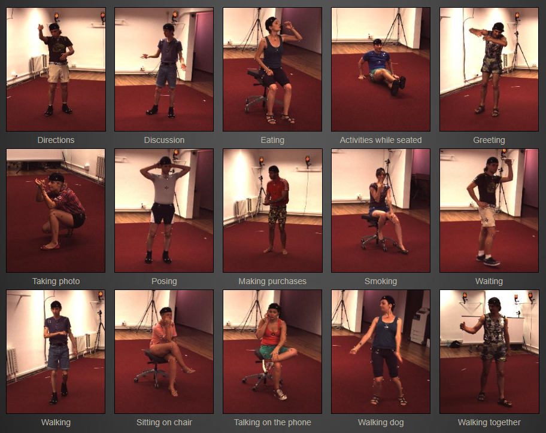
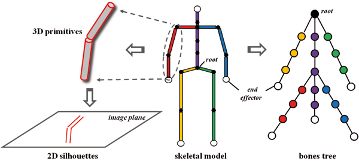
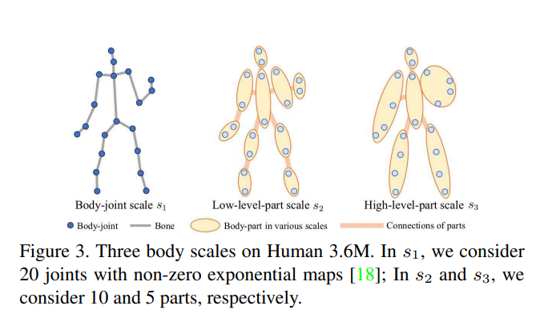
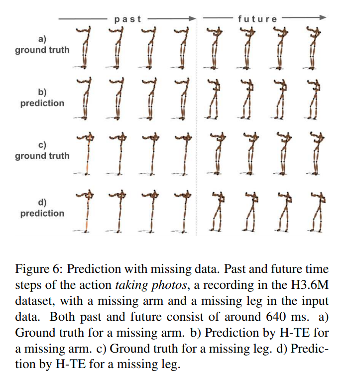

Since a research paper on using machine learning to make predictions about avatars’ movement in VR caught my attention, I’ve been looking into human motion prediction more generally. This particular VR-based study was examining the subjective benefits that the prediction your avatar’s full-body movement could have.[^1] Departing from the desirability of body ownership illusions in immersive virtual environments (which I’ve written more about in this [post](./new-forms-of-realism-illusions-of-bodies-in-impossible-spaces)), motion prediction could be used as a way to compensate for lags or processing issues that might otherwise interrupt smooth and accurate movement in an avatar’s body in VR.

The prediction of bodies’ movement has a much wider scope though. In this post I’ll go through some of the applications, approaches and implications of this domain. This is interesting to us, as we’re toying around with the idea of what it would be like to embody a virtual body that acted out your intentions — for example ahead of time, or simply instead of you.

### Applications

Machine-readable representations of human motion have applications for tasks like action classification, motion prediction and motion generation. Most of the research going into this is among fields like AI, human-computer interaction, computer vision, or robotics. 

Think of projected uses like tracking and recognition of pedestrians, interpretation of actions by an interface or inference of intention by an autonomous vehicle. For the time being some of these are still a while away from taking effect; for example the prediction of the motion of pedestrians has proven to be equally, if not more accurate by assuming that they continue at a constant velocity than by using sophisticated neural network models.[^2] Other applications like motion recognition and mapping are underway; gait recognition is a tested and accurate method in computer vision, while robots or 3D models can easily be made to move inline with the mapping of a human’s motion, using mocap.

import Video from './video';

<Video
  videoSrcURL="https://www.youtube.com/embed/7-UtQlbWfz4"
  videoTitle="Humanoid dancers in Club Quarantäne"
/>

_Humanoid dancers in Club Quarantäne during CTM Festival 2021. A project by Club Qu, IOR50 Studio & CTM Festival._

What researchers are trying to get at is to move beyond the one-to-one mapping and individual recognition, towards more generalisable inferences and short- and longer-term predictions — i.e. how will I continue moving after I’ve moved like this for a bit? Like most machine learning problems, this requires some sweeping generalisations and massive amounts of data.

### Available data

Current research is using datasets like the [CMU Graphics Lab Motion Capture Database](http://mocap.cs.cmu.edu/) or [Human3.6M](http://vision.imar.ro/human3.6m/description.php) to train and test models. These include data on human poses carrying out a selection of actions. Both were collected using different motion capture setups and summarise motion as sequences of joint positions. It’s interesting to look at which actions and poses are recorded in these datasets, as these then have a formative role in the human motion that machines can get good at reading, and potentially generating.

_The 11 scenarios recorded in the Human3.6M dataset._

Accurate modelling and prediction of the actions captured by datasets like these is then a driving factor for new research. In many papers on machine learning approaches to human motion prediction, the researchers focus on predicting patterns in ‘walking’, ‘eating’, ‘smoking’ and ‘discussion’[^3][^4][^5] — these are  to motion prediction kind of like the MNIST digits are to character recognition. The efficiency of a model in predicting these actions has essentially become a benchmark for the field, which (obviously) makes for a somewhat limited understanding of the breadth of human movement. In this sense, datasets like these might begin to shape the types of actions that machines will once expect us to be doing.

Data collection is potentially also where the increasing personal use of motion-based input technologies like VR comes in. While datasets like the two mentioned above required hours of in-lab recording with actors strapped into sensors and/or mocap suits, today VR users generate strides of data in their free time, from the comfort of their homes. This means we’re likely to see a massive upsurge in data on human motion in the coming years, but we are also left to wonder who will be able to use it, and for what purposes.

### ML-fit Bodily representations

It’s not only the motion that needs to be machine-readable, but also the human form — I always find it interesting to look at the modes of representation and terminology that come along with this.

Human motion, here, is described in terms like ‘a highly non-deterministic process over long time horizons’.[^3] This makes it a challenge to model, classify and predict.

Although this is in no way unique to the context of machine learning, the body tends to be represented as a series of bones connected by joints; a humanoid is primarily a skeleton. Just like in physics simulations or 3D modelling, computer models work well with representations of the human body consisting of joints with a hierarchy. In such tree models, the root of a humanoid is located around the pelvis. From there it’s the snowballing movement of the joints that sets us in motion.

_An illustration of the breakdown of a humanoid into a tree of joints.[^6]_

In the context of motion prediction, incorporating such representations into the models used has proven to lead to better predictions. In other words, it is useful for machines to be given information about relations between and constraints of body parts. Some approaches use these joint hierarchies,[^4] while others represent the body using abstractions like ‘dynamic multiscale graphs’ where nearby joints are merged together to form different scales of the body.[^5]

_The human body represented as a 3 scale graph: these are the bodyjoint scale, the low-level-part scale, and the high-level-part scale.[^5]_

In training and subsequent testing of models, researchers use standard data science moves like injecting noise to the dataset, or removing certain data points. Conceptually it’s interesting to think about this in the context of human motion and the body: what is noise to movement? And how is it that if we remove a limb from the motion of a body, a model will attach one in its predictions? None of this is too profound, but interesting and potentially relevant to discuss outside the narrow computer science field that it sits shielded in.

_Predictions of movements with missing data. The two conditions depicted here are labeled ‘Eating (right arm missing)’ and ‘Eating (left leg missing)’.[^4]_

### Feeding predictions

And as a final thought, overall performance is always a concern in this domain. With all the talk of feeding networks and their efficiency, given the focus on the human body we’re in a domain that has a nice semantic crossover for these phrases. It’d be interesting to figure out how much energy is needed to fuel predicted movements.

[^1]: Schwind, V., Halbhuber, D., Fehle, J., Sasse, J., Pfaffelhuber, A., Tögel, C., ... & Henze, N. (2020, November). The Effects of Full-Body Avatar Movement Predictions in Virtual Reality using Neural Networks. In 26th ACM Symposium on Virtual Reality Software and Technology (pp. 1-11).

[^2]: Schöller, C., Aravantinos, V., Lay, F., & Knoll, A. (2020). What the constant velocity model can teach us about pedestrian motion prediction. IEEE Robotics and Automation Letters, 5(2): 1696-1703.

[^3]: Martinez, J., Black, M. J., & Romero, J. (2017). On human motion prediction using recurrent neural networks. In Proceedings of the IEEE Conference on Computer Vision and Pattern Recognition (pp. 2891-2900).

[^4]: Butepage, J., Black, M. J., Kragic, D., & Kjellstrom, H. (2017). Deep representation learning for human motion prediction and classification. In Proceedings of the IEEE conference on computer vision and pattern recognition (pp. 6158-6166).

[^5]: Li, M., Chen, S., Zhao, Y., Zhang, Y., Wang, Y., & Tian, Q. (2020). Dynamic multiscale graph neural networks for 3d skeleton based human motion prediction. In Proceedings of the IEEE/CVF Conference on Computer Vision and Pattern Recognition (pp. 214-223).

[^6]: Zhang, L., Brunnett, G., & Rusdorf, S. (2011). Real-time human motion capture with simple marker sets and monocular video. JVRB-Journal of Virtual Reality and Broadcasting, 8(1).
