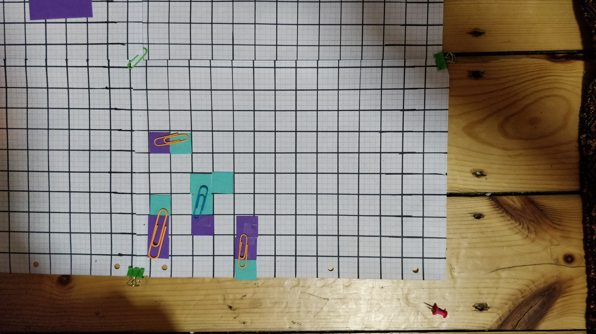
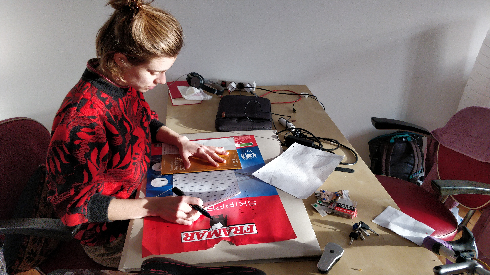

Today, as part of our preparation for a game-playing sessions with the full team (Alex, Roel, Jae), we created a table-top strategy game.

As yesterday we looked at ideas of movement we wanted to use today to think around ideas of subtraction or sacrifice. We thought something along the lines of starting with a piece of paper and cutting out pieces should increase complexity.

If you take a piece of paper and make concave cuts it increases the perimeter. Increasing it's exposure to the environment. Conversely if you make convex cuts along the edges, you end up approximating a circle. Having the lowest perimeter with the highest surface area means a circle, by our measure, is the least exposed to the environment.

We took inspiration from the "grid" game Jae used to play in long car trips in Australia. Where you essentially race to draw enclosing squares on a grid to capture areas. We also looked at Agar.io, the idea that consumption somehow hinders you. And the ideas of centralised control, whereby our brains cascade movement in to our limbs.

## The Game

### Terminology

- Unit squares - The smallest unit. These are coloured according to the player they started with
- Composite - A shape made from at least one unit square

### Rules

- Each player starts with a 3x2 rectangle of unit squares of an individual colour
- Players place this anywhere on a 14x10 grid
- The game is played in turns. On each players turn they choose one of their composites to:
  - Move - horizontally or vertically the max number of squares in a row of their current shape in that direction. Players may not land their composite on another
  - Cut - their composite by a line of one unit length along the gridlines.
    - If a new composite is made from this cut, it must be moved 1 unit away from the original composites edges in the direction perpendicular to the cut
    - Cuts cannot be made along the boundary between two different colours
    - If a new composite is made, it must have at least one of the players unit squares attached to it. Otherwise the composite goes to the player with the most unit squares in that composite
  - Stick - If the chosen composite has edges of single unit length, and is moved on to another composite it will stick. This new composite is now under the control of the current player
  - Flip (untested) - A player may move a composite by flipping it along a side so long as it has a length of more than 1 unit

### Observations

- The game feels very similar to chess, however is more aesthetically pleasing.
- We were not entirely happy with how strategic the game becomes. We often sat thinking for a long while mapping out trees of current moves and reactions. This is why we added the concept of flipping. This will attempt to add more dynamics to the game.
- The addition of the ability to control a piece only if you have a minimum of one of your own colour allows for a sort of re-composition of the body in to containing, preferentially, more of others. Our composites become cyborgs in their own right.
- We rejected ideas of added randomness, and talked about the ability of adding more environmental elements, such as larger boards or more players to add chaos to the game
- We played for an hour or so and managed to come to a win state. So we consider this a success! It was even fun.

## Our findings
