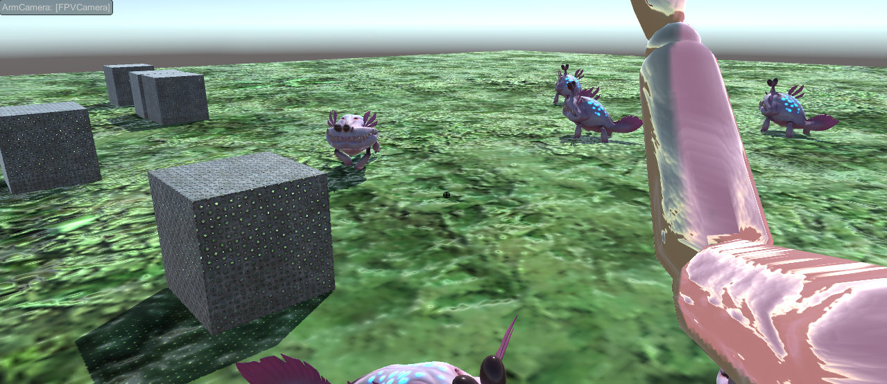

Over the past few weeks we’ve been working in Unity to put together a simple environment that we could use as an experimentation space for developing our game idea further. For this we decided to implement a level that features an arm as a playable character - more on this process and outcomes in [this post](./). In this post I summarise some of our reflections on this latest prototype and discuss a new idea that these led us to.

### Controlling detached limbs

import FigureCaption from './FigureCaption';

In this latest game prototype, the player has control over the given limb character. They can get the arm to point, wave, crawl, grab, or release on demand, and use these actions to interact with the surrounding environment. The game mechanics are based on our [‘Planet of Zentra’ concept](./making-maps).

_The arm character in our prototype waving from first person view._

Although the actions are adapted to what an arm can do, the player is pretty much always in control in this setup. The gameplay is much like that of any other playable character. Instead of a humanoid avatar players have an arm to work with, but for the rest there’s really not much difference in how you ‘play’ the arm.

In some sense this multiplies and distributes the player’s potential for intentional control; instead of a single, necessarily localised and connected body, the player would now have a number of individually controllable limbs, or different torso-limb configurations, at their disposal. This, we agreed in our last meeting, is potentially contradictory to some of the ideas that we’ve been developing throughout our research process.

Stemming from this element of control, we might find ourselves (unintentionally) implying that the arm would only be useful if we could manipulate it intentionally - if we could give it a brain of its own, or drive it by a player’s real-time decisions. This builds on the criticism of extending neural matter to the limbs that I made in a [previous post](./from-assemblage-brain-to-assemblage-body) discussing Tony Sampson’s _Assemblage Brain_.

What if then, you don’t have intentional/ cognitive/ conscious/ rational/ brain-directed control over your limbs once they are detached, but they _can_ still participate in and influence the environment?

Muscle memory might be one way.

### Muscle Memory game concept

Would today’s thumbs still know how to scroll if severed?

Thinking from this question, we came up with a mechanic which would use non-conscious, internalised behaviour to direct limbs’ motion, rather than real-time conscious decisions:

> A game in which you “train” your limbs to perform certain movements, that they then loop through if detached. Limbs have muscle memory, but are not controllable once detached (except to reattach).

Roel mentioned Tom Galle and Moises Sanabria's Salmon & Meat Phone.

Jae gave the example of Bombchu Bowling in _Ocarina of Time_ - a rat bomb that you set off, but follows its own path once it’s out of your hands. This means you need to figure out and anticipate its behaviour in advance. This is an example of the type of game object that a detached limb could become, if no longer controlled by the player in real-time.

import Video from './video';

<Video
  videoSrcURL="https://www.youtube.com/embed/asTd9OOAGq0"
  videoTitle="Bombchu Bowling"
/>

Although I mention ‘training’ above, we had briefly discussed two different ways in which the non-conscious behaviour of the limbs could be determined.

> Limbs have their own predetermined behaviours which we would base on some of the ways in which we use our limbs in today’s society. Hands like typing, thumbs are inclined to scroll, legs often dangle off chairs…
>
> Players train their limbs when performing actions while they are connected to the torso and brain. The emergent behaviour might accumulate throughout the game, or - for the sake of simplicity and, eventually, required time to change behaviour - be based on the last _n_ actions a connected body makes.

Either way, this could enable us to bring in a sustained element of bodily awareness into the game; training or anticipating the movements of detachable body parts that think in their own ways.
