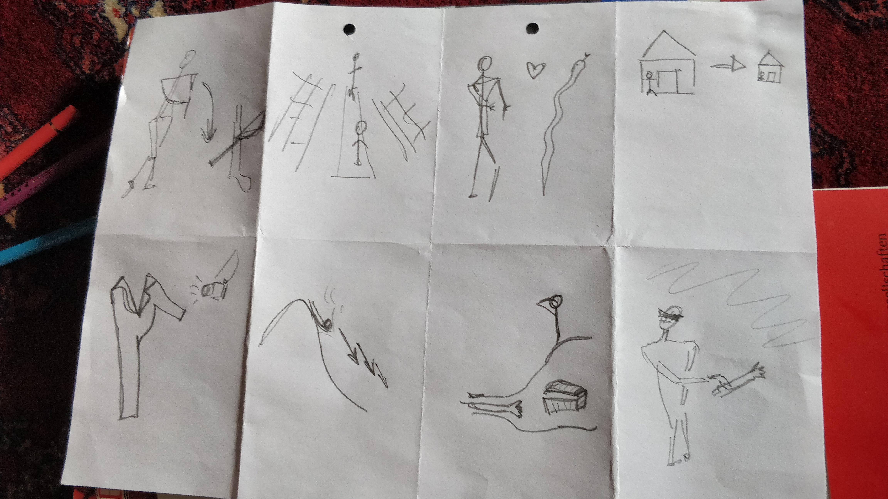
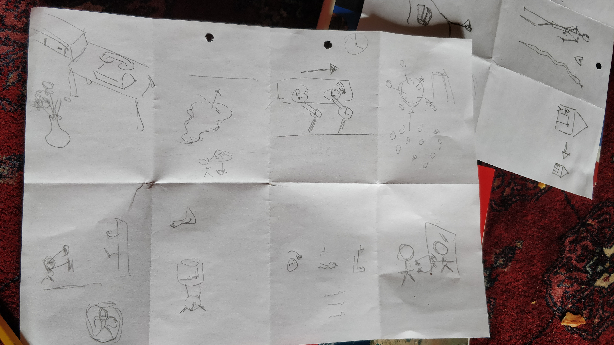
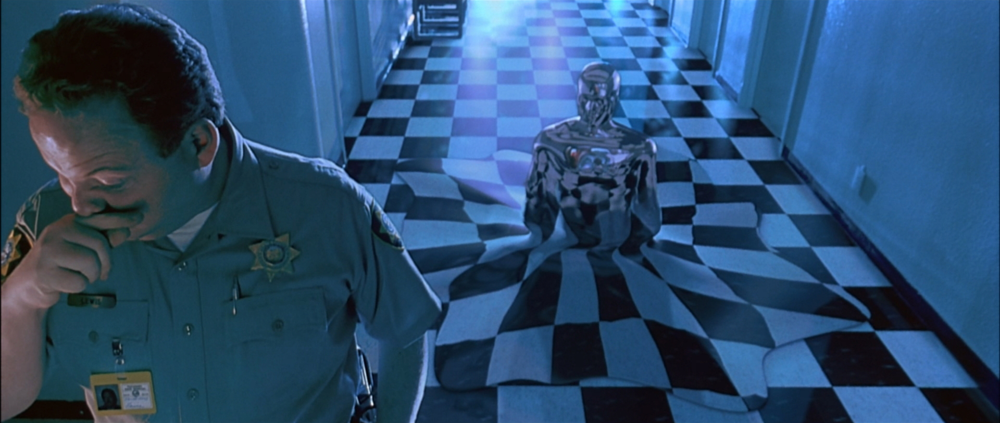
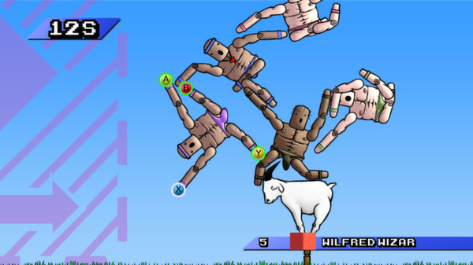
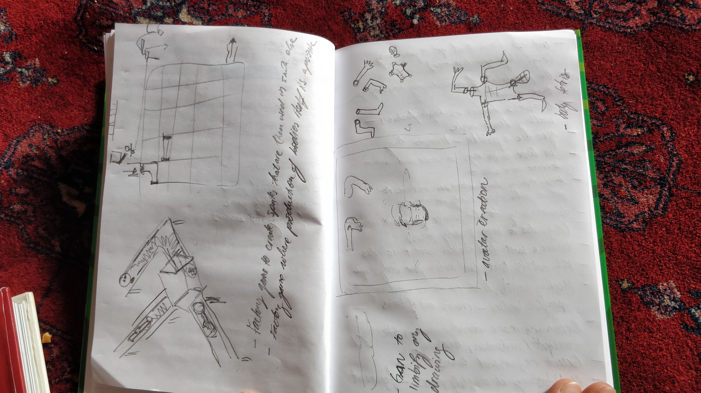
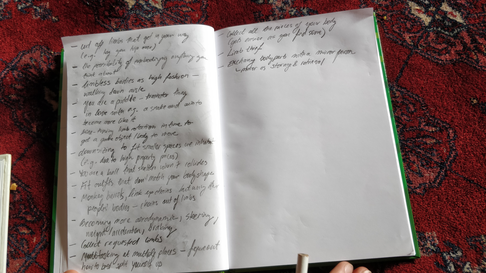

import FigureCaption from './FigureCaption';

Hoping to come up with more game ideas and move towards sketching these out digitally, we did another crazy eights brainstorming session. This time our focus was the somewhat broad issue of ‘thinking of possible game ideas that we could develop further as a part of our project’. We were a bit hesitant to start off with this vague task, but seeing as the exercise only takes 8mins, it seemed worthwhile to give it a go.

We came up with a number of interesting ideas, with which, we thought, we are beginning to approach our concept in some new ways. Following our exchange and discussion of the individual ideas that we came up with, we grouped, rethought and categorised these by their overarching themes or approaches. I elaborate on the outcomes in the rest of this post.

### Narrative Concepts

A number of the concepts that we came up with were most suited as a possible game narrative. Narrative is something that we haven’t really thought about yet, so we were happy to have wandered into this domain through the exercise.

> You are in love with and agent with a different body shape (e.g. a snake) and aim to make your body-shape more compatible with it  
> You are a limb thief doing their job  
> A ‘Dude where’s my body parts?’ game - you need to search the environment for pieces of your body. There could be stories associated with where you left or lost them, and clues as to where they might be. This game becomes more dynamic over the course of its progression, perhaps even easier, as you find some body parts. Maybe you can borrow body parts that are not yours if you find them along the way.

<!-- 

<FigureCaption text="The cover of 'Dude Where's My Car' (2001)" /> -->

### Adapting your body to external demands

A theme that repeated across a number of the ideas that we came up with was making - potentially extreme - bodily modifications to match demands coming from the outside. This theme could potentially be developed as a game narrative too.

> A world in which limbless bodies become high fashion - you need to walk them down the catwalk (glamorously)  
> You need to fit outfits that do not match your body shape to begin with  
> You need to downsize your body to fit smaller spaces that you have no choice but to inhabit (e.g. your 1m2 room, which is the biggest you can get due to increasing rent and property prices)

### Embodiment

We also thought of possible game ideas in which your body is much more fluid than the constraints of the usual body parts and the ways in which they fit together would allow. Why not transform, liquify or split up endlessly?

> You have the possibility of embodying any object that you think of in a game  
> You are a puddle (terminator-like thing) and can merge/ stick/ paralyse things that come into contact with you  
> You are a ball that shatters when it collides with other objects. You need to direct the chaotic flock that amasses throughout the game

<FigureCaption text="A still from 'Terminator II' (1991), the T1000 terminator could be something that our puddle aspires to become in the game" />

### The body as a physics object

We thought of several ways in which changing the shape of your own body could perhaps be turned into a fun physics exercise.

> You manage a set of joint rotation clocks (/ limb clocks). You need to fine-tune a the intervals in which individual limb rotations happen to make a body move  
> You are falling. You need to modify your body to optimize the fall; to become e.g. more aerodynamic, to steer, to brake, to accelerate (taking weight into consideration)  
> A monkey barrels-like game, where you link up chains using other peoples’ bodies - these could be chains made out of limbs, rather than just whole bodies

<FigureCaption text="A screenshot from 'Mount Your Friends' (2014), a game that could serve as inspiration for our monkey-barrels game idea" />

### Puzzle games

We still find that thinking of clever ways to slice or divide a body up can be translated into interesting puzzle/ strategic problems.

> A game in which you can exchange limbs with your own mirror person. The mirror serves as a storage and retrieval of the (double) set of limbs that belongs to you  
> A game in which you need to multitask, but the tasks are at a number of different places at once. You need to figure out how to best split your body up to achieve this. You keep track of each body part across a split screen view that corresponds to your cuts.

### Other ungrouped and abandoned ideas

Finally there were a few ideas that stood alone. Generally though we did not really find these interesting enough to pursue, so we group them under ‘Other’ here and briefly reflect on the reasons why we’d rather avoid these approaches.

> A game in which you cut off limbs that get in your way (e.g. a leg that you keep tripping over)  
> A game in which you collect requested limbs in buckets

The first of these is simply uninteresting. The second, bucket game has potential to become fun; we thought it could be a strategic game where you carefully move buckets around so that the right limbs drop or fall into them. Our issue with this idea though, was that the body is no longer the subject of the game, but its constituent parts are just props that could be replaced with other objects, like fruit. As such, focus on the body is lost.

