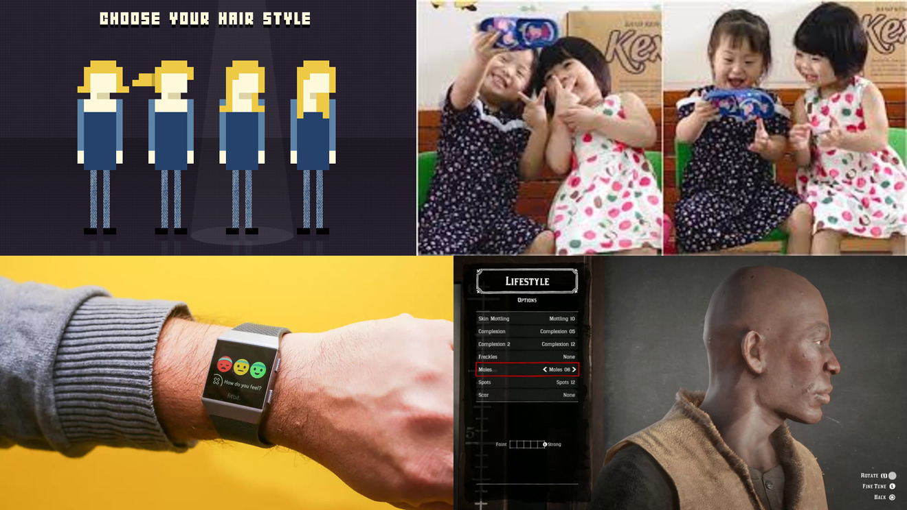

Questions of body image in the so-called digital era are a hot topic across academic, artistic and design practices. Our proposed game concept stems from the confluence of digital environments and their impact on 1) body image and 2) relationships to physical environments.

## Through tech I become better: higher-tech selves, hi-tech bodies

Digital technologies influence peoples’ body images; they provide some of the tools that fuel the trend toward self-optimization. This occurs across domains, in real life (IRL), or in virtual worlds.

## Through tech I’m in control: lessons learnt in God Mode

At the same time, interface properties like personalisation or customization put users and/or players in a position of control, shaping their interactions with the (virtual) environment. Individuals’ behaviour in virtual and physical environments cannot be isolated; spillover effects are unavoidable. 

Some of these spillover effects have become a key focus of research in human-computer interaction. Studies suggest that a range of factors experienced in virtual environments have lasting effects outside of it. These factors include for example the avatar’s body shape relative to its likeness to the represented individual,[^1] the avatar’s eating behaviour,[^2] or hair style.[^3] Across cultures, Western-style “perfect bodies” have been shown to be the aspired ideal; in the long run, digital bodies show less diversity than our physical ones.[^3] Personalisation processes are said to actively configure our normative worldviews.[^4] 

In video games, it is custom for the player’s avatar to influence its surroundings for success, rather than vice versa. A winner’s chosen body remains untouched, or improved. 

Take for example Mario, where destruction is the virtuous path to saving the princess. A winning Mario grows from surrounding mushrooms and stars. These optimisers are yielded from demolition of the environment. Or take for instance games with more diverse options for progression such as World of Warcraft; when a new playable character is introduced, one is first given access to a ‘God Mode’ version. In ‘God Mode’, nothing in the environment can affect the player. This effect is then taken away, as if to set a goal or aspiration for this totality of control. Commenting on interface design more broadly, researchers suggest that actions like ‘zooming’ and perspectives like ‘Globe view’ facilitated by the virtual imbue us with a sense of control over nature. 

[^1]: Fox, J., & Bailenson, J. N. (2009). Virtual self-modeling: The effects of vicarious reinforcement and identification on exercise behaviors. Media Psychology, 12(1), 1-25.

[^2]: Fox, J., Bailenson, J., & Binney, J. (2009). Virtual experiences, physical behaviors: The effect of presence on imitation of an eating avatar. Presence: Teleoperators and Virtual Environments, 18(4), 294-303.

[^3]: Ducheneaut, N., Wen, M. H., Yee, N., & Wadley, G. (2009). Body and mind: a study of avatar personalization in three virtual worlds. In Proceedings of the SIGCHI conference on human factors in computing systems (pp. 1151-1160). ACM.

[^4]: Reijers, W., Gordijn, B., & O’sullivan, D. (2016). Narrative ethics of personalisation technologies. In IFIP International Conference on Human Choice and Computers (pp. 130-140). Springer, Cham.
