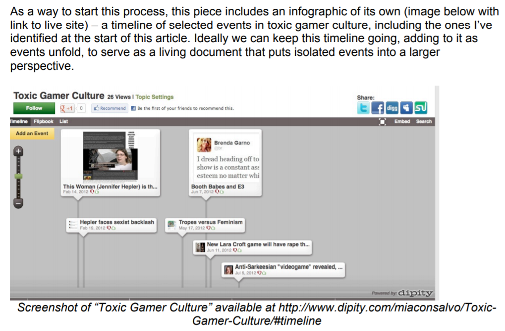

>Games are inherently interdisciplinary. 
>Games are inseparable from their players.

Doing some initial research into the (academic) field of game studies reiterated these two points through a number of disciplinary approaches. Games are interesting in that they consist of both, representational layers and a system of rules that make up the gameplay. One take I read on this distinction is the idea of a ‘shell’ and ‘core’ respectively.[^1] There are contrasting views on which of these parts should be the primary issue of concern when it comes to analysing games; some put the focus on the narrative (narratology), while others on the systems of rules and abstractions (ludology). Either way, it’s hard to deny that a game inherently consists of both, if not more, parts.

If a game is inseparable from its players, then they are present in the design process as well. In this initial phase, the player is imagined, but always implied. On this Mäyrä writes:

“Rather than a historical, flesh-and-blood person, the implied player is a “role made for the player of the game, a set of expectations that the player must fulfill for the game to ‘exercise its effect.’””[^1]

There’s something interesting in this for our exploration of embodiment in games; what role does the player’s body assume if it is displaced by an imaginary set of expectations as early as in the design phase?

### Play

 Mäyrä goes on to discuss Hans-Georg Gadamer’s idea that a work of art is rooted in play. In condensed terms, this implies that a (played) game is a work of art and, at the same time, precludes it from being understood as an object; according to Gadamer, “[t]he mode of being of play does not allow the player to behave towards play as if towards an object.”[^1]

Play, to me, is inherently a bodily and spatial activity. It unfolds in an environment, together with other co-incidental bodies - fellow players, opponents or obstacles. Understood this way, we could once again begin to form a potentially more verbose argument for the reconsideration of the role of a player’s body in video games.

### Alternatives for fun and play

One of the main things we are trying to do in the research phase of our project, is to come up with a way of reimagining the ingrained expansive/consumptive desire of digital bodies in games. Or in other words, to keep play fun for a player who is not engaged in stereotypical actions that would constitute ‘winning’ or ‘success’. Self-realising in texts like this one though is the possible pitfall of overcomplicating things, overtheorising. Fun is pretty important here. Is play still play if it’s not fun? By extension, does a game lose its gameness along with its fun? An issue that is relevant for us to keep in mind.

Fun, though, has no absolute form and different communities of players are on the lookout for alternatives. Take as an example the relatively widely discussed concern of feminist game studies scholars for making video games more inclusive for women. Clearly this is a contested issue. Proposing ways to address hostility that certain groups feel in game environments, Consalvo initiated an open source documentation of events in toxic gamer culture in the form of an online timeline.[^2]

The link followed now leads to a porn site - a tribute to the plurality of fun.

One useful way to start thinking the theory of play openly may be through queer game studies. As a field that situates itself neither under game studies, nor under queer theory, but somewhere inbetween, queer game studies aims to propose alternatives. Borrowing from queer theory, scholars/ makers/ gamers in this domain try to challenge some of the lonstanding givens in our understanding of games through their work and play. These include for instance dichotomies like: narratology/ludology, production/reception, control/agency, success/failure.[^3]

Challenging some of these dichotomies, as well as the understanding of the above-mentioned issues, like success or agency in the game context is our central concern.

Queer game studies shares a relatively pronounced focus on bodies and spaces. Returning then to the issue on its way to paradox, that games are inseparable from their players, yet their makers reduce those same human players to a set of expectations, this approach could be one way around. In the introduction of a book that shares its title with the field - _Queer Game Studies_ - the editors state that we ‘can view games as spaces where we play within and against rules and explore representation’.[^2] This understanding of games is a start to overcoming the body of expectations.

[^1]: Mäyrä, F. (2009). “Getting into the Game: Doing Multi-Disciplinary Game Studies”. In: Bernard Perron and Mark J.P. Wolf (eds.), The Video Game Theory Reader 2. New York: Routledge. pp. 313-329.

[^2]: Consalvo, M. (2012). Confronting toxic gamer culture: A challenge for feminist game studies scholars. Ada: A Journal of Gender, New Media, and Technology, 1(1), 1-6.

[^3]: Ruberg, B., & Shaw, A. (Eds.). (2017). Queer game studies. U of Minnesota Press.