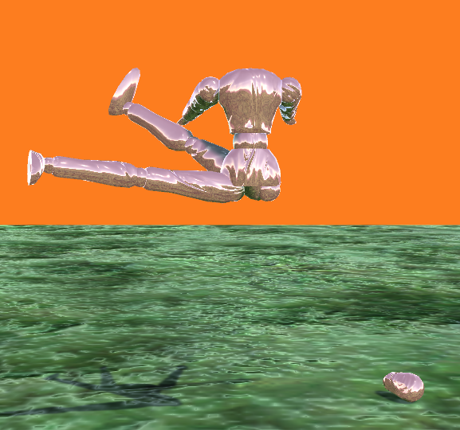
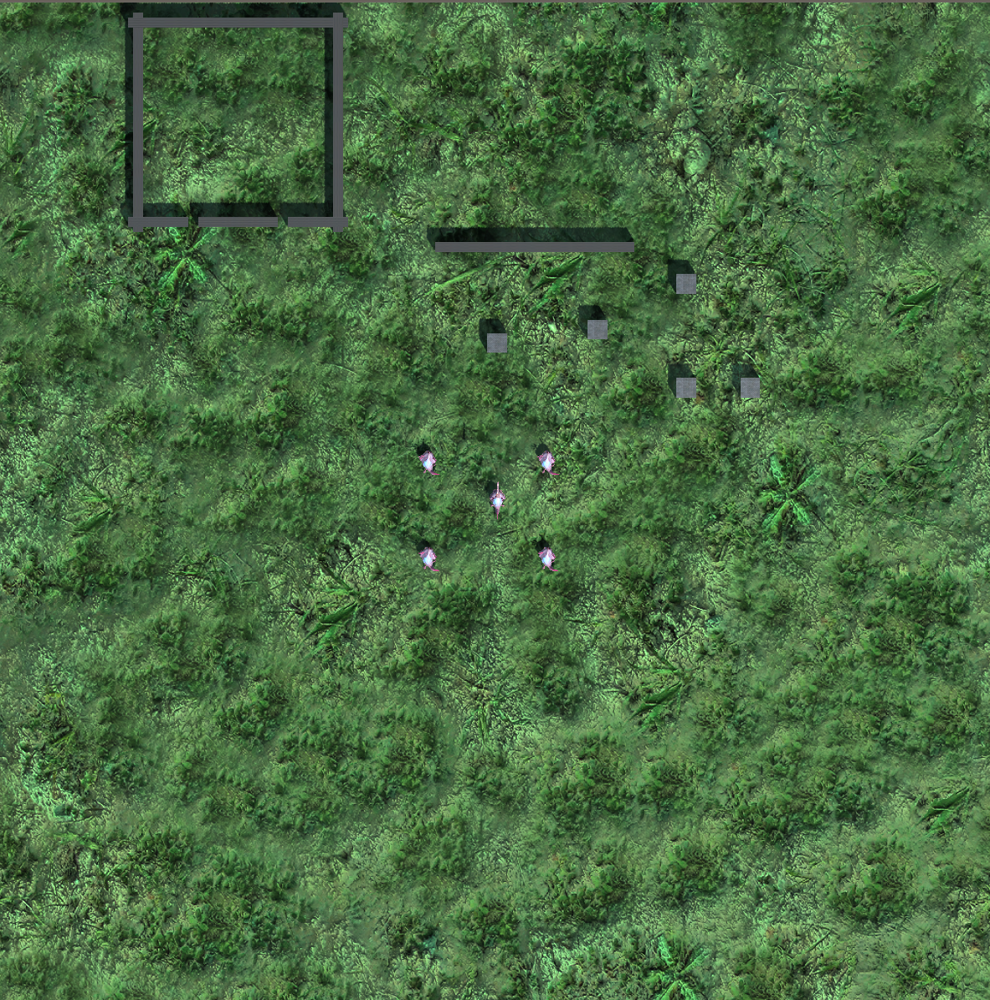
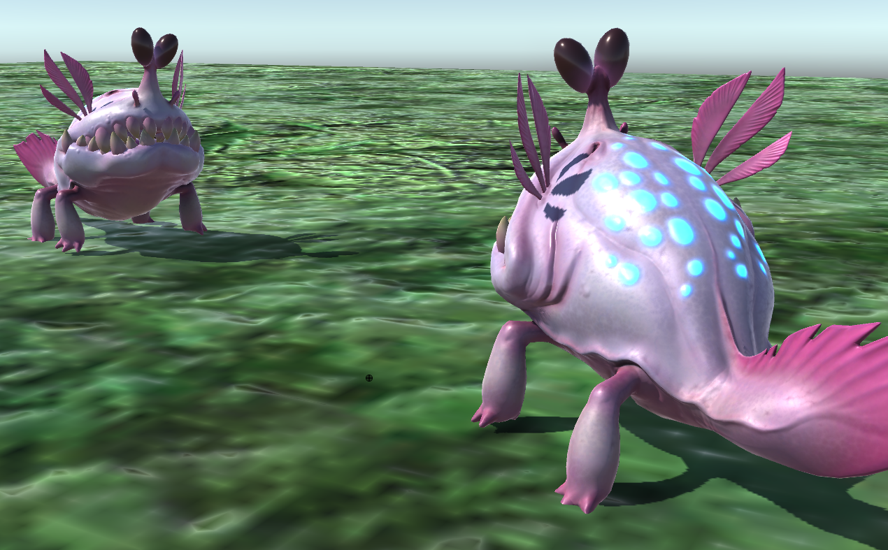

Over the last 3 weeks or so we started working on implementing a few of the ideas within the [Zentra game concept](./making-maps).

Inspired by the likes of game dev tutorials and news we've been keeping up with, we decided to use Unity to achieve this. Both Alex and I have had passing experience in using the engine in other projects of ours, however none with an interactive focus. So this placed us in a good (and safe) position to hopefully move from extreme beginners to just plain old beginners on the platform.

Here we will highlight these concepts with short recordings, some images, and brief explanations.

### Reconfiguring your limbs

Here Alex practiced her skills in Blender to create a rigged model that is able to reconnect in different configurations, and implementing the interactivity of this inside Unity. The user can mouseover a joint to see their cursor change from a pointer to a crosshair, indicating that they can sever/attach the limb at that joint.

import Video from './video';

<Video videoSrcURL="https://www.youtube.com/embed/-6KslNEnLus" videoTitle="Reconfiguring limbs" />

We found this to be a satisfying and simple interaction that gives a familiar feeling of popping off a doll's limbs as a kid. We might have thought of adding the satisfying popping sound too.

Eventually something like this could serve as an interface to reconfigure your body throughout, or at given moments, in a game - much like a character selection/ personalisation menu. Alternatively it might be possible to pop limbs on and off in a similar way during gameplay, rather than in a separate interface view.

This exercise was useful for us in figuring out how a character can be split up into separate autonomous parts, that can be treated as characters in their own right. The discrete body parts shown in the video - the head, torso, arms and legs - are each separate models, individually rigged. We then attach and detach them by parenting them to their respective positions in Unity.

### Playing an arm

One part of the Zentra map was designed to be completed by a severed arm. The goal of this was to round up animals and get them in their pen. To achieve this we quickly placed in the pen and some obstacles, alongside the AI agents so that we could begin interacting with the world. The clips in the following playlist illustrate some of the character actions and incteractions.

<Video videoSrcURL="https://www.youtube.com/embed/videoseries?list=PLhzcrKkJOlAVU7Icx57gVxaaebVZsp-HR" videoTitle="Reconfiguring limbs" />

For now the environment is just a flat, regular plane, but this was enough to start playing around with things like character controllers, camera motion or interactions with NPCs.

#### The character

We animated the severed arm to give it the ability to crawl, wave, point, and grab. These are the core actions required to complete this scenario. In the designed level map in Zentra you would have to summon an animal, climb on it’s back, and then direct it into the pen.

#### Basic movements

We implemented basic WASD controls to move around the world and added the ability to jump with the Spacebar. We also implemented keyboard and mouse controls for the actions of waving, pointing, grabbing and releasing.

#### The camera

We used a mix of first and third person views here. The third person camera gives you scope of the area, and the first person gives you both a sense of embodiment, and precision in “aiming” the animals around the field.

#### The NPCs

At first we used simple shapes for prototyping with highlighting of different colors to indicate their current state/behavior. We later replaced these with “Chompers”, which come fully animated and skinned from one of Unity’s sample asset packs. They immediately gave us some feeling of life in the scene.

