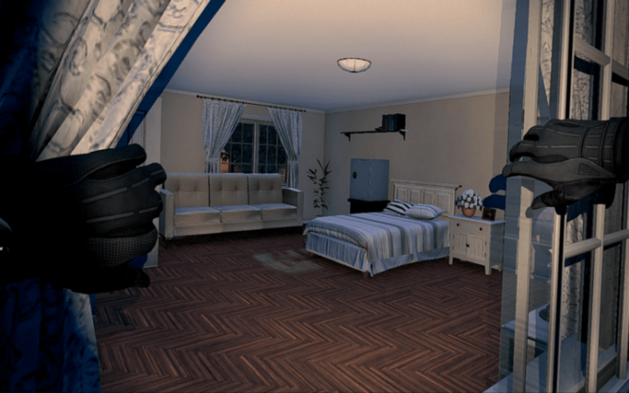
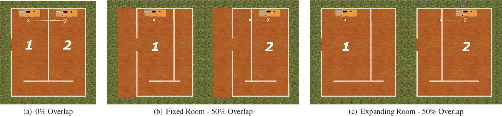

Researchers and developers working with VR have been exploring ways in which the technology can be used to benefit people’s bodies — think exercise, therapy or even treatment. Not only is it great to see that VR has much potential across these fronts, but such experiments also reveal many interesting nuances about the ways in which we relate to and perceive our bodies. In this post I’d like to give an overview of some of these findings.

### Body ownership illusions

First person VR experiences can challenge users’ usual body representation and generate body ownership illusions over the avatar’s body. While this effect has been shown to be strongest when the virtual body’s size and motion match that of the user, I find it perhaps more interesting that the so-called illusion kicks in even when there’s a mismatch. For instance, an illusory sense of ownership over moving limbs can be evoked despite a strong visuo-motor mismatch between somebody’s vision and proprioception.[^1] Conversely, the synchronisation of movement can boost the body ownership illusion over a virtual body that is very different in size or shape to that of its user.[^2] This is noteworthy in that it suggests that VR can offer us embodied experiences of bodies and movements that are unlike, or perhaps even completely different from our own.

_Stills from different conditions of a study that experimented with very long arm illusions in VR. Body ownership illusion declined with the length of the arm, but continued to be experienced nonetheless.[^3]_

### Pain relief

Internal body representations seem to be strongly connected with sensations like pain. Seeing virtual bodies, especially while experiencing body ownership illusions has been shown to have analgesic effects; meaning that technologies like VR can essentially be used as a means to pain relief.

This has been tested by measuring people’s pain thresholds (based on things like their resilience to high or low temperature stimuli) as well as in the context of rehabilitation or medical treatment of patients whose conditions cause them pain. Studies on the treatment of severe burn patients for example, have paralleled the effects of VR with opioids.[^4] The treatment of phantom limb pain is another tested application of VR as an effective treatment of both phantom pain and sensations.[^5]

The potential of VR to jack into very real and often physically inhibiting sensations like pain is a surprisingly bodily effect that the medium can have.

### Motivation

This one is probably no different to a claim that would have been made when the first VHS workout tapes came out, but still might be worth mentioning: VR can motivate and encourage people to move. Both as a form of fitness training, as for example, the countless VR workout games reviewed on [VR Fitness Insider](https://www.vrfitnessinsider.com/) illustrate, and as a form of rehabilitation.

_A scene from Thief Simulator VR, a game in which movements like crouching give you a great leg workout, [according to a review by VR Fitness Insider](https://www.vrfitnessinsider.com/review/thief-simulator-vr-game-review/)_

Research in the domain of rehabilitation has been quite extensive. Generally speaking, studies report positive effects of VR in both cognitive and motor rehabilitation treatments. To date, research has largely focused on the treatment of neurological diseases, like Parkinson disease, multiple sclerosis, acute and chronic poststroke, traumatic brain injury and cerebral palsy. Although some cast a sceptical eye on this new wave VR-rehabilitation as something that owes its popularity to being  ‘just an entertainment for scientists’, the results from their studies do suggest tangible improvements in patients’ conditions.[^6] These include things like improved balance and gait,[^7] or speech, attention and memory skills.[^8]

_An example of a VR-based stroke rehabilitation task. This is a still from a demo of [VirtualGrasp](https://www.youtube.com/watch?v=PCfiAA84Yhs) by Gleechi_

Success of VR in rehabilitation is often attributed to boosting motivation and participation of its users, which in turn encourages better responses to treatment. In this sense it’s been labelled a useful complement to conventional therapies that can enhance their effects. In reducing overall hospitalization time, this means that the time spent in such virtual therapy spaces/exercises can multiply the patients’ time outside, moving better in real life. Just another example of the use of virtual bodies having effects that spill outside the confines of their virtual worlds.

### Impossible spaces

VR offers new environments to reevaluate notions of realism in. Subjective experiences in VR are often intensified, or arguably improved, through a sense of realism in the experience. Realism experienced virtually though, need not correspond to the realism that we attribute to life outside the headset.

Dealing with space is one of the areas in which the issue of realism comes up. How do you let users/players explore a vast open virtual space from within the physical confines of their living rooms or bedrooms? Although some newer headsets no longer require a cabled connection or a bounded play area, practically speaking, most people explore VR inside spaces bounded by walls. These walls are the obstacles that have gotten designers and developers thinking about ways in which VR spaces could feel realistic, even though people cannot navigate them in real-world realistic ways.

Teleportation is one commonplace mechanic to move around while still, but it’s lacking realism is also an easy target for criticism. Locomotion techniques like teleportation are labelled as unrealistic in the sense that there’s a mismatch between the player’s physical movement used to invoke an action and its outcome in the virtual space; i.e. the index fingers’ click of a controller results in the displacement of an avatar’s entire body in space.

As alternatives, researchers and designers are exploring forms of locomotion and spatial navigation that might feel more consistent across the real and virtual worlds. This entails things like the hyper-realistic scaling of a player’s actions. For example, one study explored a ‘jump-based locomotion augmentation technique’ (which they called JumpVR) in which a user’s jumps would be scaled to cover much larger distances in a virtual space.[^9] Such alternatives combine ‘realistic physical movement with hyper-realistic virtual outcome’ and, in this study, proved to increase presence, motivation and immersion in the participants’ VR experiences. Besides such potential benefits to the experiences of VR, discussions like these raise interesting conceptual questions/distinctions. Here for instance, is the opposition between ‘unrealism’ and ‘hyper-realism’ of certain virtual outcomes.

Addressing the issue from a different direction, other experiments have looked into transforming the virtual representation of spaces rather than user’s movements. Virtual spaces consisting of several rooms for example, have proven to feel realistic even if the individual rooms making up the entire map overlap by as much as 56%.[^10] This means that users can walk uninterruptedly between virtual rooms and get the impression that these all fill their own unique space, even though they might be walking back and forth across the same strip of carpet, physically speaking. Using this technique for map design is interesting as it delivers a sense of realism through bending euclidean space, or designing what the researchers behind the study referenced above call ‘impossible spaces’.

_A floor plan of overlapping adjacent rooms used in some of the experiments with 'impossible spaces' carried out by Suma and colleagues[^10]_

Realism, in this sense, can be understood as enabling the consistency and continuity of movement, rather than adhering to a one-to-one mapping of physics or euclidean space.

To wrap up, I’ve mainly collated findings from many different movement-focused VR studies here, but, I’d say that these are a great starting point for thinking about the ways in which we might use and experience movement in virtual spaces.

[^1]: Zanini, A., Montalti, M., Caola, B., Leadbetter, A., & Martini, M. (2017). Pain during illusory own arm movement: a study in immersive virtual reality. European Medical Journal, 2(2): 90-97.

[^2]: Kim, S. Y., Park, H., Jung, M., & Kim, K. (2020). Impact of Body Size Match to an Avatar on the Body Ownership Illusion and User's Subjective Experience. Cyberpsychology, Behavior, and Social Networking, 23(4): 234-241.

[^3]: Kilteni, K., Normand, J. M., Sanchez-Vives, M. V., & Slater, M. (2012). Extending body space in immersive virtual reality: a very long arm illusion. PloS one, 7(7): e40867.

[^4]: Hoffman, H. G., Richards, T. L., Van Oostrom, T., Coda, B. A., Jensen, M. P., Blough, D. K., & Sharar, S. R. (2007). The analgesic effects of opioids and immersive virtual reality distraction: evidence from subjective and functional brain imaging assessments. Anesthesia & analgesia, 105(6): 1776-1783.

[^5]: Rutledge, T., Velez, D., Depp, C., McQuaid, J. R., Wong, G., Jones III, R. C. W., ... & Giap, H. (2019). A virtual reality intervention for the treatment of phantom limb pain: development and feasibility results. Pain Medicine, 20(10): 2051-2059.

[^6]: Tieri, G., Morone, G., Paolucci, S., & Iosa, M. (2018). Virtual reality in cognitive and motor rehabilitation: facts, fiction and fallacies. Expert review of medical devices, 15(2): 107-117.

[^7]: Porras, D. C., Siemonsma, P., Inzelberg, R., Zeilig, G., & Plotnik, M. (2018). Advantages of virtual reality in the rehabilitation of balance and gait: systematic review. Neurology, 90(22): 1017-1025.

[^8]: Maggio, M. G., Maresca, G., De Luca, R., Stagnitti, M. C., Porcari, B., Ferrera, M. C., ... & Calabrò, R. S. (2019). The growing use of virtual reality in cognitive rehabilitation: fact, fake or vision? A scoping review. Journal of the National Medical Association, 111(4): 457-463.

[^9]: Wolf, D., Rogers, K., Kunder, C., & Rukzio, E. (2020, April). JumpVR: Jump-based locomotion augmentation for virtual reality. In Proceedings of the 2020 CHI Conference on Human Factors in Computing Systems (pp. 1-12).

[^10]: Suma, E. A., Lipps, Z., Finkelstein, S., Krum, D. M., & Bolas, M. (2012). Impossible spaces: Maximizing natural walking in virtual environments with self-overlapping architecture. IEEE Transactions on Visualization and Computer Graphics, 18(4): 555-564.
