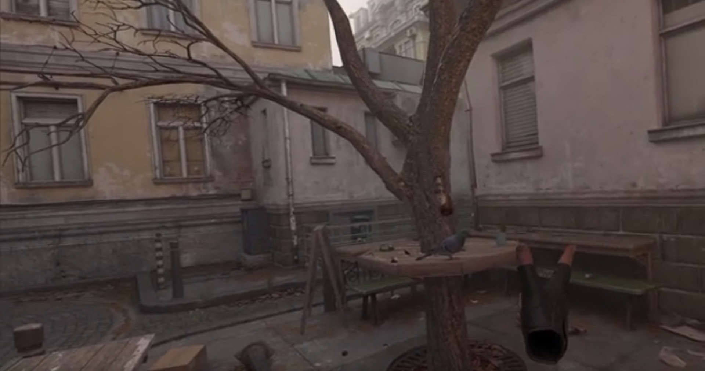
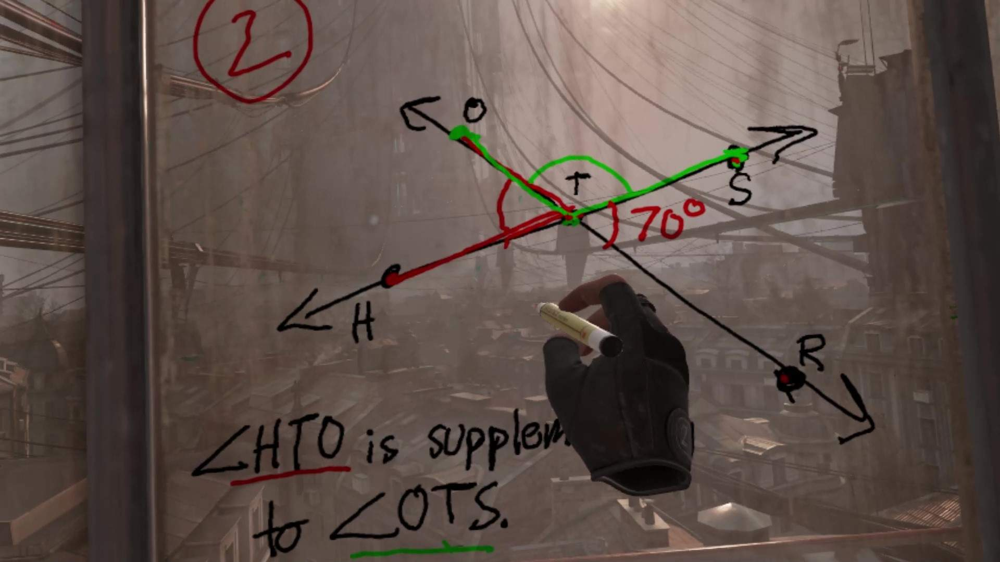

To juggle in VR, do you need to know how to juggle in real life?

import Video from './video';

<Video videoSrcURL="https://www.youtube.com/embed/FRoJpmez1po" videoTitle="Juggling in Half Life: Alyx" />

As VR makes our game interactions ‘more realistic’, ‘more immersive’ etc. etc., what implications does this have on the way in which we act and move in a game? Perhaps as we edge towards a ‘real’ virtual experience, we also take away from the possibility of using video game environments to enact things that would otherwise be unattainable to us. In the context of our game and this post, I mean primarily physically unattainable to us; running up walls, jumping across valleys, doing double backflips - whatever the action might be. 

If more immersion brings us closer to real life mobility, this conversely also traps us by the restraints of our own physical limitations. The variety of and detail in movements made possible in VR may greatly inflate, but their scope may be narrowed to just what we ourselves can do. The game environment then becomes primarily a backdrop filter to situate our actions, rather than a space in which we can effectuate skills unimaginable to us.

### A space to practice mundane movement

The list of fun things to do in the Half-Life: Alyx intro published on PCGamer[^1] consists of:

> - Make your mark with a marker
> - Spark a revolution (by throwing a can from the balcony)
> - Feed a Snark (feed a pet, kept in a jar)
> - Spin a globe
> - See Dog's baby picture
> - Mess with pigeons
> - Put a traffic cone on your head
> - Try riding a bike (while wearing a traffic cone)

The possibility of doing these activities in a virtual world no doubt shows a great deal of attention to detail within the game environment. At the same time though, they are actions that wouldn’t take much coordination to do IRL. Actually they’d be somewhat underwhelming, some even mundane.

It’s cool to see math teachers solving problems in the latest Half Life, but, thinking body, the game used this way no longer stretches our bodily limits. For a majority of people, neither do most of the actions listed above. As games adopt controllers that more faithfully translate our own motion in game environments then, moving in ways that are physically impossible - on both the individual and species levels - becomes excluded from the set of accessible game dynamics.

Coming back to the example of juggling, we had to wonder: would juggling in a game become exclusive to those who could juggle physical objects too? Of course this may give you the needed incentive and space to practice and learn, as well as a certain kind of immersive (life-like) game experience. But the space of a VR game then suddenly becomes much less inviting to attempt unusual or exceptional bodily movements.

### Implications for our game

This is not necessarily meant as a criticism of VR, but rather as an early point of reflection on how the medium compares to other game formats like 2D platformers or 3D video games. Controlled by your own body, VR may limit our corporeal and motoric imagination in a game environment. The more abstract, dissociated control mechanics of other games may be better suited to create spaces in which players can attempt to enact and/or embody the unimaginable.

[^1]: [https://www.pcgamer.com/create-graffiti-wear-a-traffic-cone-hat-and-8-other-fun-things-to-do-in-the-half-life-alyx-intro/](https://www.pcgamer.com/create-graffiti-wear-a-traffic-cone-hat-and-8-other-fun-things-to-do-in-the-half-life-alyx-intro/)
