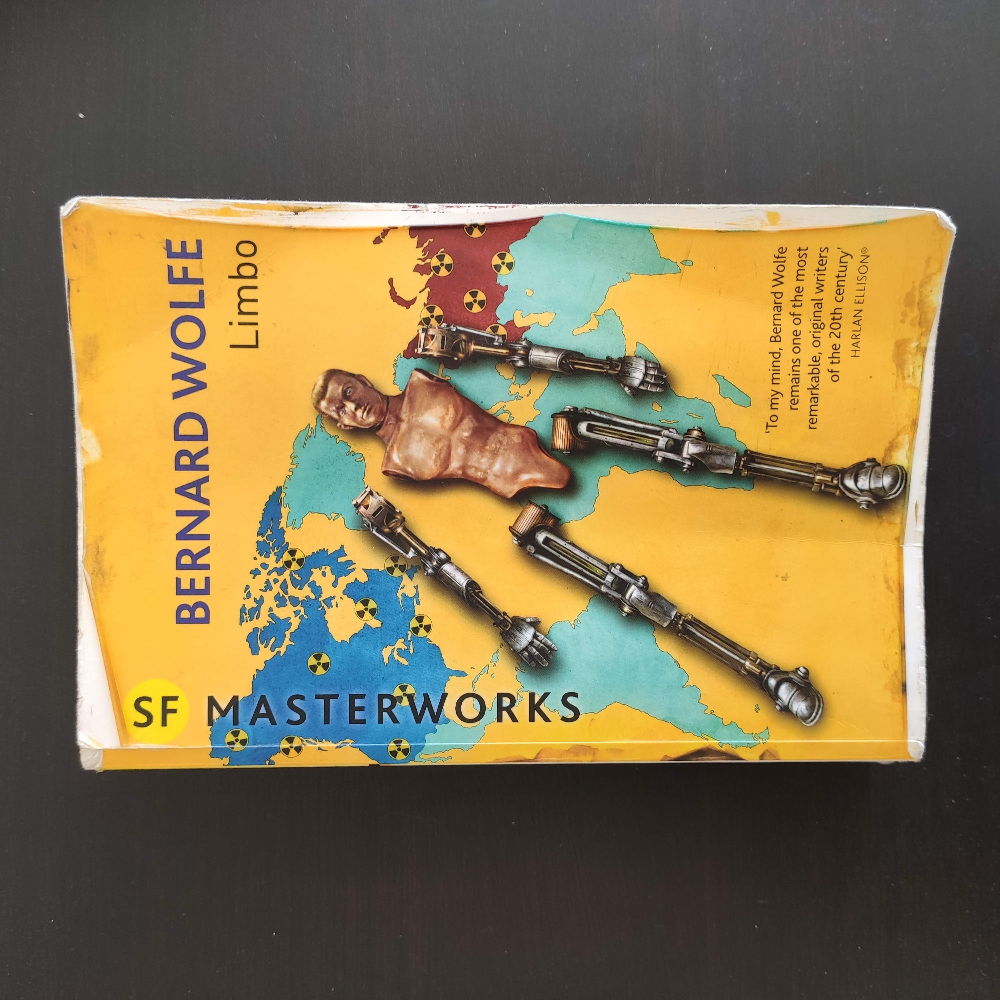
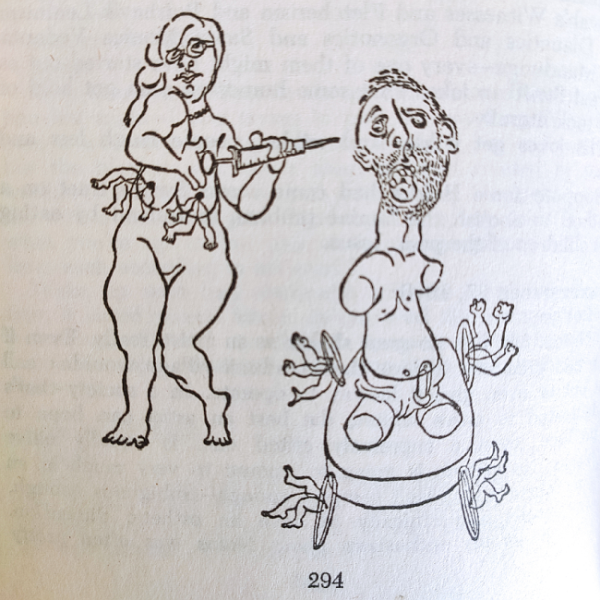

_Limbo_, a 1952 novel by Bernard Wolfe, caught our attention before we started working on this project. It is one of the few sources we could find that deals explicitly with a world where the literal act of cutting off limbs becomes habitual.

In a post-nuclear war dystopian society, amputation is reimagined as a path to pacifism. Martine, a war escapee and the book's main protagonist, has been performing _manduga_ on an island in the Indian Ocean since 1972; a ritual lobotomy aiming to purge the aggression out of its subjects. Eighteen years later, in 1990, a curious group of English-speaking outsiders pays a visit to his thus far isolated refuge. 

> 'All of these men had four artificial limbs, always four.' (p. 24)

These strangers, some with flamethrowers in place of arms, seem to be looking for something. They scavange around the island, not thinking much of burning any vegetation that gets in their way.

> 'When they stopped, those in the lead pulled the tools from their arm stumps, picked up regular plastic arms which were hanging from their belts and snapped them into place in the empty sockets.' (p. 25)

Stunned by this encounter, Martine sets out to rediscover what’s become of Northern America; once his homeland, now the 'Strip'.

### Unthinkable body politics

In Limbo, Wolfe uses the almost comical absurdity of an exaggerated scenario to think unthinkable body politics. In this post I’d like to discuss some of the body-related themes that we found interesting to think about in the context of our game.

#### Bodies as victims

While serving as a surgeon in the Third World War, Martine jotted down some joking ideas for ways in which a seemingly impossible peace could be sustained in his personal notebook - later to become the founding text for the basics of Immob. Self-victimisation as a means to satisfying an innately human masochistic tendency is, in Martine’s sarcastic vision, one of the key factors in starting and fueling war. War both creates and necessitates victims - it ultimately satisfies twisted desires. Devoid of the possibility to become victim, war would be undesirable to the masochist buried deep down.

The victimisation afforded by war comes from the losses it incurs. ‘Clipped’ is a term that was adopted as a way to refer to people who had lost limbs in war. Entering the jargon of daily life, it signifies a situation in which bodily subtraction becomes commonplace; a shared experience and public acknowledgement of victimhood, rather than an abnormality. A clipped individual is a victim, as their body is disfigured without their choice. But what if they had a say in it? What if it were voluntary?

> ‘That way, maybe a sorehead word like clipped would never even be thought of. Not when a guy’s a _voluntary amputee_. A vol-amp.’ (p. 204)

Martine proposes voluntary amputeeism as a strategy to end war, as war is self-contradictory without victims.

> ‘Eventually you might even go the whole hog and make up a slogan about disarmament being impossible with arms around.’ (p. 205)

With this, Wolfe explores themes of humanity’s potential for self-destruction, as well as self-victimisation. He points to the role our bodies assume in armed conflict and turns to some pretty cynical solutions for imagining self-restraint. Weapons in this sense, are simply extensions or appendages to the arms our bodies already possess.

#### Consuming limbs

> ‘Straining to fix his eye on discrete objects as the fantastic blur sped by, Martine could make out here and there squadrons of manufactured items riding out on the conveyors to the shipping departments: refrigerators, bicycles, upholstered armchairs, prefabricated cottages, electric toasters, automobiles, passenger planes, tractors, television sets, typewriters, adding machines, books, bathtubs, flags. And artificial limbs: at one point Martine was sure he spotted a line of gleaming plastic legs traveling along.’ (p. 332)

Factories pumping out limbs. The ultimate product with a world full of potential buyers. Everyone needs arms and legs after all. Just imagine the demand, and - not to mention - the profits.

With the mass production of limbs for an eager customer-base of vol-amps, Wolfe takes consumerism to an extreme. As body parts are made replaceable, they become disposable, consumable. In _Limbo_’s pacifist world run by Immob, conflicts arise over columbium, the rare metal required to make the best and latest prosthetics (pros).

The thought experiment of limbs-turned-consumables is particularly relevant to take into account in the development of our game concept, as we had primarily considered focusing on the body as a means of escaping the environmental exploitation that drives most video game dynamics. Wolfe’s Immob society points to ways in which even limbs can become implicated in a political economy.

> ‘Martine pointed down at another belt line loaded with artificial limbs. “More legs,” he said. “To genuflect before the machines that make legs”’ (p. 333)

#### Outsourcing bodily control

Back in Northern America, Martine gets to witness one of the most important public events in which the two world’s opposing superpowers, the Strip and the Union, face each other: the Olympics. In _Limbo_’s 1990, Olympics have become a showcase of the latest pros, where muscle power or physical fitness of the individual athletes no longer has any bearing on their results. It is the work of engineers that determines bodily mobility publicly performed by athletes. Sporting achievements become ‘cyber-cyto accomplishments’. Indeed, when the unioners claim victory is the Olympics, the primary question everyone is asking, voiced by the television commentator is: 

> ‘But how, how did it happen? What’s the thing mean, _cybernetically_ speaking?’ (p. 302)

And commenting on this cyber-cyto victory in a public speech broadcasted into the homes of people across the world, the leader of the Union uses his athletes’ bodily performances to make a claim on the world’s most valuable natural resource.

> ‘The union engineers have been working very, very hard on prosthetics. Now it is proved that we can make the best pros in the world, better even than the master minds of the Strip. By the logic of the Strip imperialists it follows that if we have such fine know-how also we should have all the columbium in the world’ (p. 305)

So an Immob body becomes both, externally manipulated and controlled, as well as a claim for the ‘right’ to environmental exploitation, in the context of the book’s geopolitical situation. It is an experimentation site and showcase of engineering accomplishments.

Engineering the body brings up questions about the value of expert domain knowledge of the body as well as externalising control over it. Do intelligent extensions or replacements make our bodies less our own? Can they mould our bodies to serve others’ purposes?

#### Human anatomy as an unchanged standard

Interestingly, the amps in Limbo stick to the humanoid form of a pair or legs and a pair of arms when fitting pros. The most honourable amp, a vol-amp, has removed all four limbs only to replace them with the same number of artificial ones. Why not refigure the body, when starting from a ‘clean’ slate?

With the flexibility of the virtual, we have considered ways in which the human body could be reconfigured when thinking about our game. Wolfe’s choice to keep the pacifist amputee four-limbed is interesting in this regard.

### Imagery

On a final note, Wolfe came up with some interesting imagery that we found noteworthy to consider and/or might use as inspiration for our own work (or perhaps more often, to stay away from). In it’s dystopian tone, _Limbo_ primarily points us to some dangers of commodification of the body and the ways in which it can be both externally controlled and used to exercise control.

Without further detailed discussion, we list some quotes that further illustrate some of the issues and imagery brought up in Wolfe’s _Limbo_ below.

#### On the pacifism of using pros

Unsurprisingly, the use of pros is contested within Immob society, which becomes polarised between Pro and Anti-Pro camps. Pros for instance, are labelled by the oxymoron ‘superactive pacifists’.

> ‘Without the pros he’s all amp and no vol. Even his pacifism isn’t a matter of choice… But fit him with _detachable_ limbs which snap on and off quicker than you can say Norbert Wiener, give him the feeling that his limbs are _voluntary_, you see, and he stops being a robot. Prosthetic limb, friends, is the means whereby man makes his great leap into human freedom’ (p. 155)

#### Cyber-cyto Olympic acts

> ‘A sequence of kinesthetic marvels - whirlings, lunges, soarings, flipflops, heaves, spins - cybercyto feats such as no Immob eyes had ever seen. All of them performed nonchalantly, with debonaire ease, by the Unioneers.’ (p. 301)
>
> ‘The jumper poised himself, he seemed only to hunch for a fraction of a second, bending slightly at the knees to give himself an upward push. Then he took off, effortlessly but with rocket-like force.  
Up, up he shot, not even bothering to scissor his legs as jumpers usually did to facilitate clearing the bar. There was no danger of his grazing the bar, he went up stiff as an arrow, body upright and arms held rigidly at his sides - zoomed past the bar, and kept going. He had easily jumped two hundred feet. When he plummeted down he bent his knees parachuter style to break the fall, landed gracefully on his oleo-strut shock absorbers and bobbed up and down a few times and marched away’ (p. 306)

#### Body turned helicopter

> 'two counter-rotating rotors attached to an elongated right arm made each man a human helicopter' (p. 25)

#### Limbless torsos

> ‘All these figures were quadro-amps - without prosthetics. Their limbless bodies, ovaloid, spheroid, stripped of geometric irrelevancies, were hidden under blue silk-edged baby blankets, which is why it had been easy at first glance to take them for dolls: only their heads were exposed.’ (p.158)
>
> ‘At first glance the room looked like a nursery: there were some eighteen or twenty baby carriages standing in a row along the long wall of the porch. In a moment he realized that the occupants of the carriages (some of them lying in pairs, their heads at opposite ends of their double baskets) were all quadros, covered with fluffy baby blankets’ (p. 260)

#### A link between aggression and sexuality

> ‘Martine nodded and stepped back, beginning to strip off his rubber gloves. “Done it again,” he said to himself. “Goddamned Siamese twins. I’ve cut out the aggression, I’ve cut out the orgasm, can’t seem to separate the two. Sorry, Moaga. The pig-sticker did his best.”’ (p. 16)
